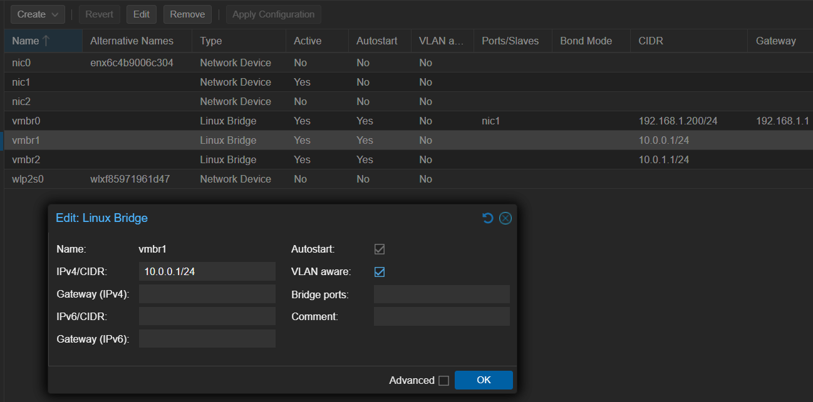
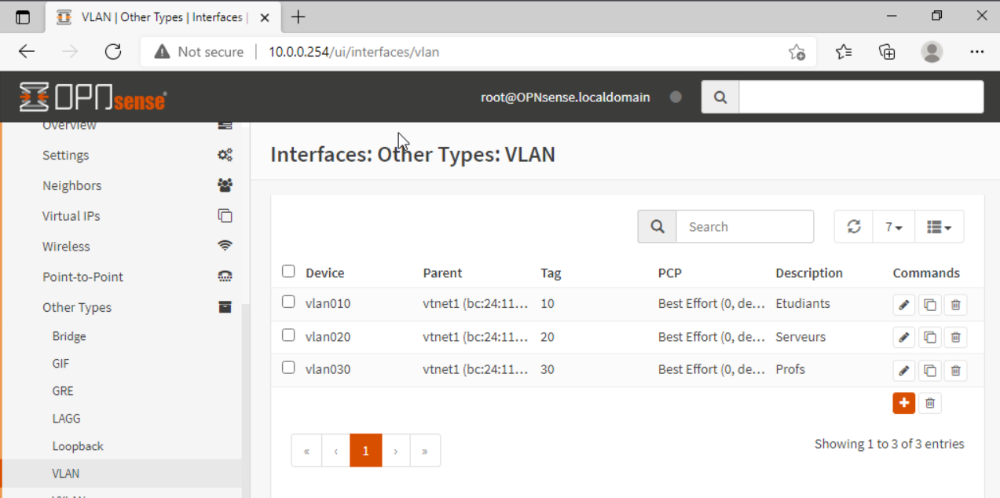
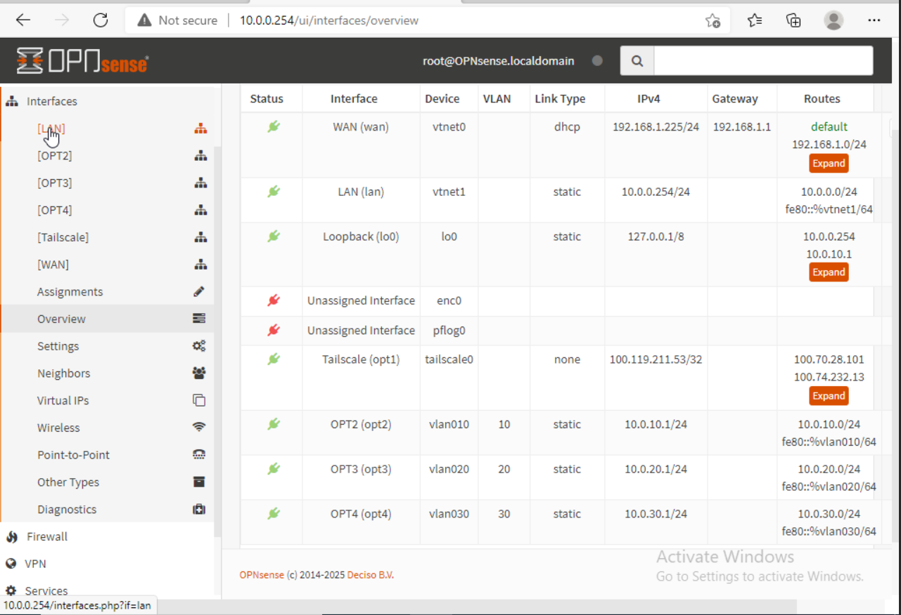
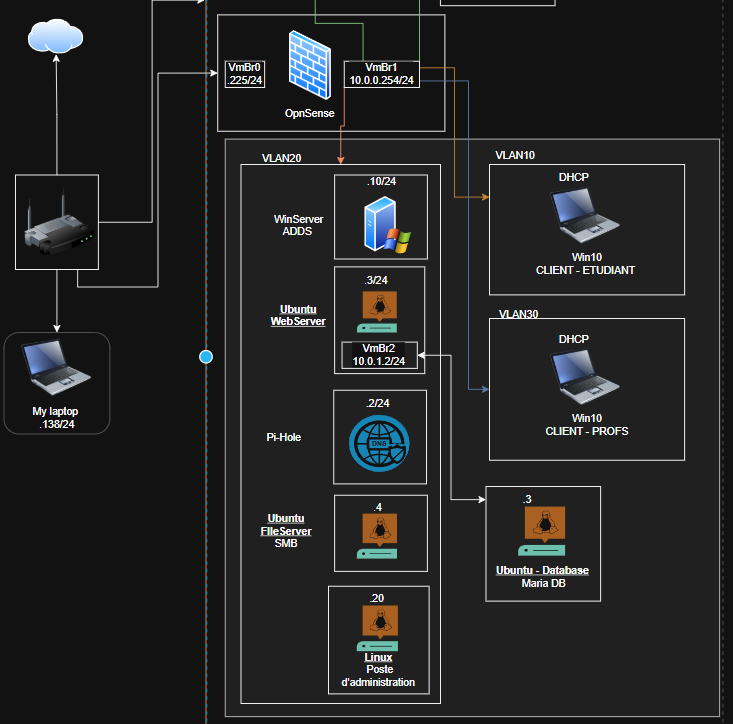

[← Retour au README](../README.md)

# **Phase 1 : Proxmox & Plan réseau**

Création des VLANs (Étudiants / Serveurs / Profs), vSwitchs, et plan des VMs/CTs à créer.

## Création des Vlans

<aside>

vmbr0 (WAN) ──► OPNsense ──► vmbr1 (trunk VLAN-aware)
                                                                       ├── VLAN 10 → Étudiants  (10.0.10.0/24)
                                                                       ├── VLAN 20 → Serveurs   (10.0.20.0/24)
                                                                       └── VLAN 30 → Profs      (10.0.30.0/24)

</aside>

## DHCP Settings

| VLAN | Range | DNS à distribuer | Gateway |
| --- | --- | --- | --- |
| OPT2 (Étudiants) | 10.0.10.100 → .200 | 10.0.20.2 (PiHole) | .1 |
| OPT3 (Serveurs) | 10.0.20.10 → .50 | 10.0.20.2 (PiHole) | .1 |
| OPT4 (Profs) | 10.0.30.100 → .150 | 10.0.20.2 (PiHole) | .1 |

## Plan des VMs et CTs

