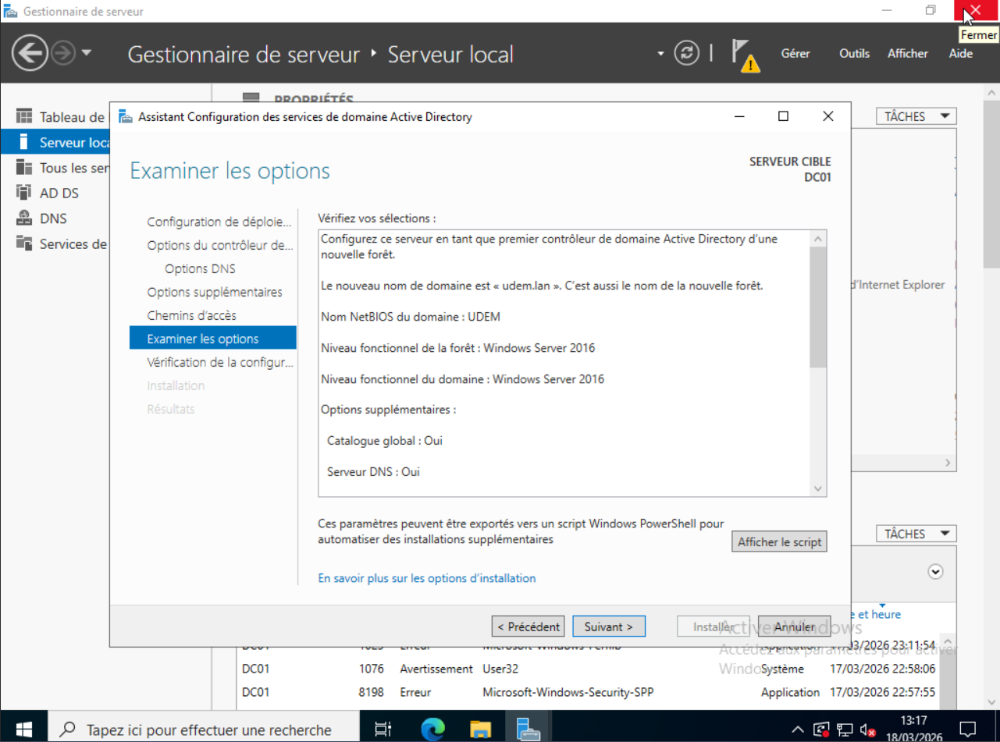
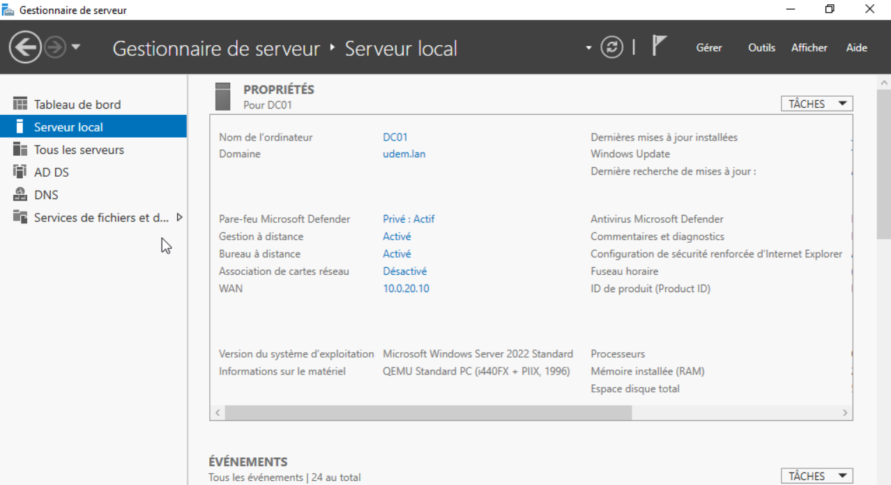
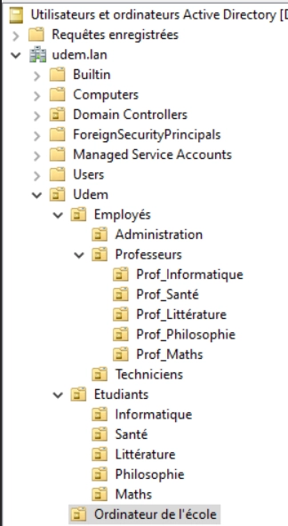
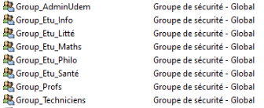

[← Retour au README](../README.md)

# **Phase 2 : Windows Server / Active Directory**

## Installation du DC et configuration du domaine

## Structure des OU

<aside>
🚨

udem.lan
├── Employés
│   ├── Administration
│   ├── Professeurs
│   │   ├── Prof_Informatique
│   │   ├── Prof_Santé
│   │   ├── Prof_Littérature
│   │   ├── Prof_Philosophie
│   │   └── Prof_Maths
│   └── Techniciens
└── Etudiants
 |         ├── Informatique
 |         ├── Santé
 |         ├── Littérature
 |         ├── Philosophie
 |         └── Maths
└── Ordinateur de l’école

</aside>

## Les groupes Globaux de Sécurité
Pour classer les utilisateurs plus tard et leurs assigner des permissions spécifiques selon leurs place dans l'hiérarchie

