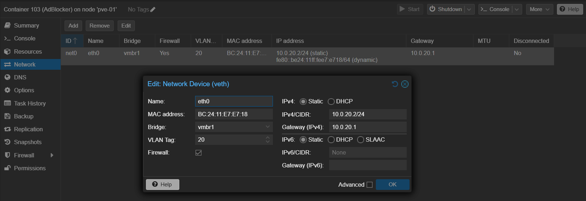
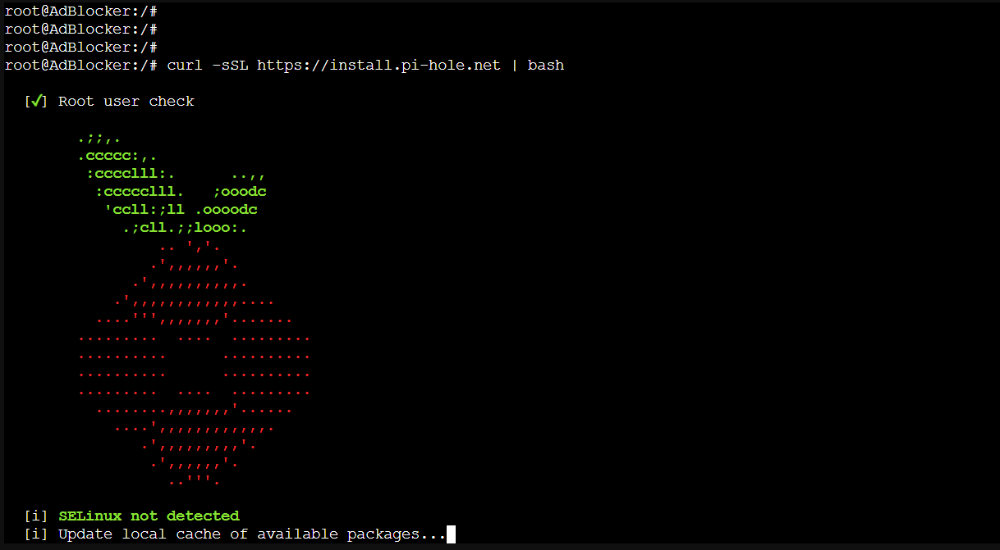
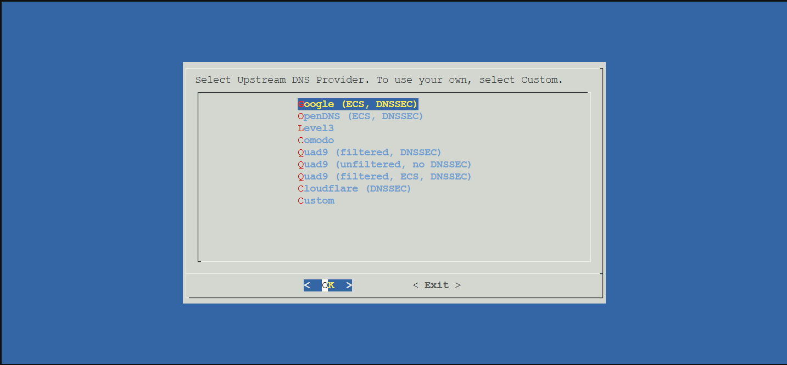
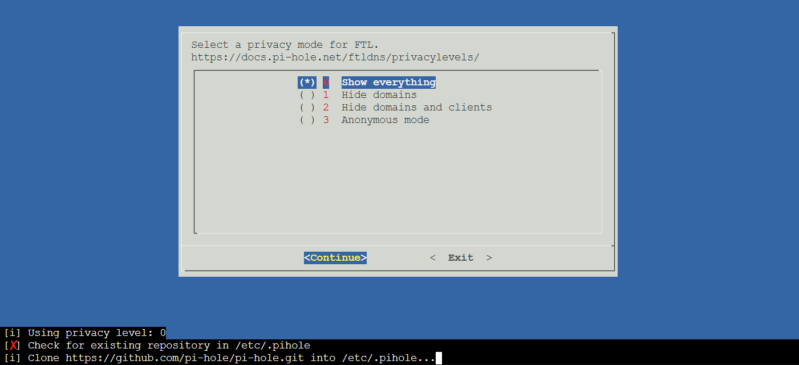
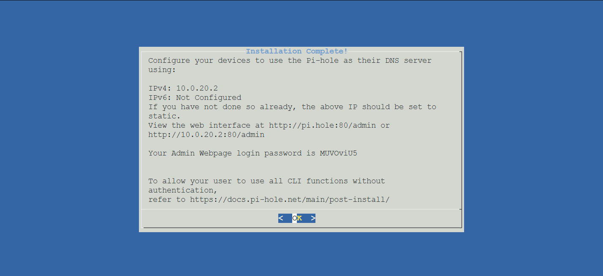
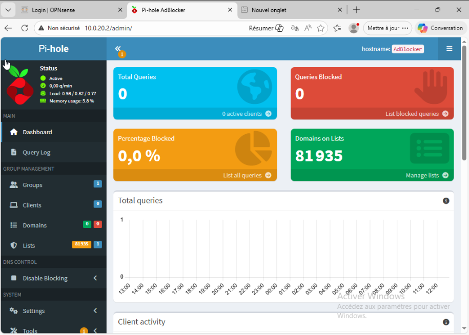
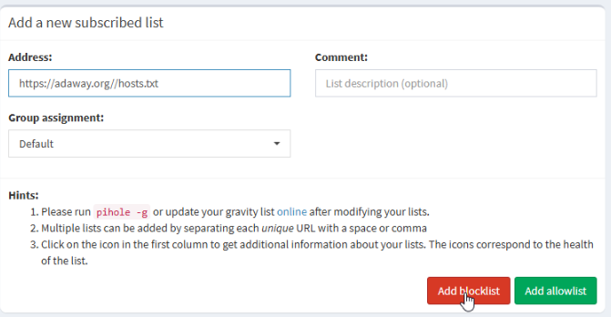
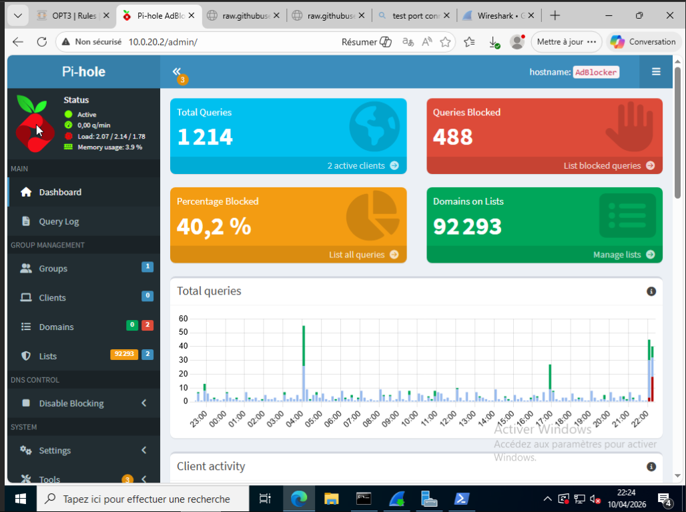

[← Retour au README](../README.md)

# **Phase 3 : Infrastructure réseau (PiHole + DHCP)**

## Déploiement du PiHole

S’assurer que l’IP de la machine est Statique

Puis on texte depuis la machine Windows 

## Ajout de liste de blocage

