[← Retour au README](../README.md)

# **Phase 5 — Automatisation PowerShell**

Script qui interroge MariaDB, crée les comptes AD sans doublons, assigne les groupes et droits SMB.

<aside>
⚙

Par défaut, Windows Server et Active Directory ne possèdent pas les outils nécessaires pour interagir avec un système de gestion de base de données comme MariaDB ou MySQL.

Le fichier `MySql.Data.dll` agit comme un **traducteur universel** :

- Il fournit à PowerShell de nouvelles commandes et de nouveaux objets (tels que `MySqlConnection` et `MySqlCommand`).
- Sans ce composant, lorsque ton script tente d'exécuter l'instruction `New-Object MySql.Data.MySqlClient.MySqlConnection`, PowerShell renvoie une erreur critique indiquant que le type sous-jacent est introuvable.
</aside>

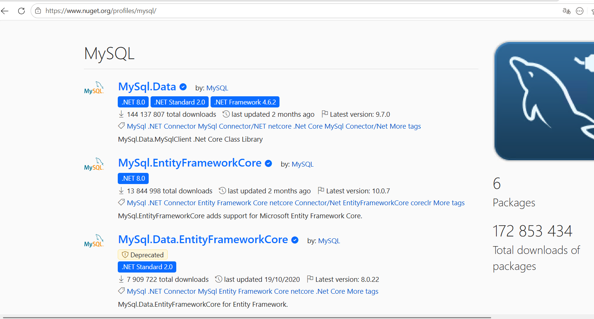

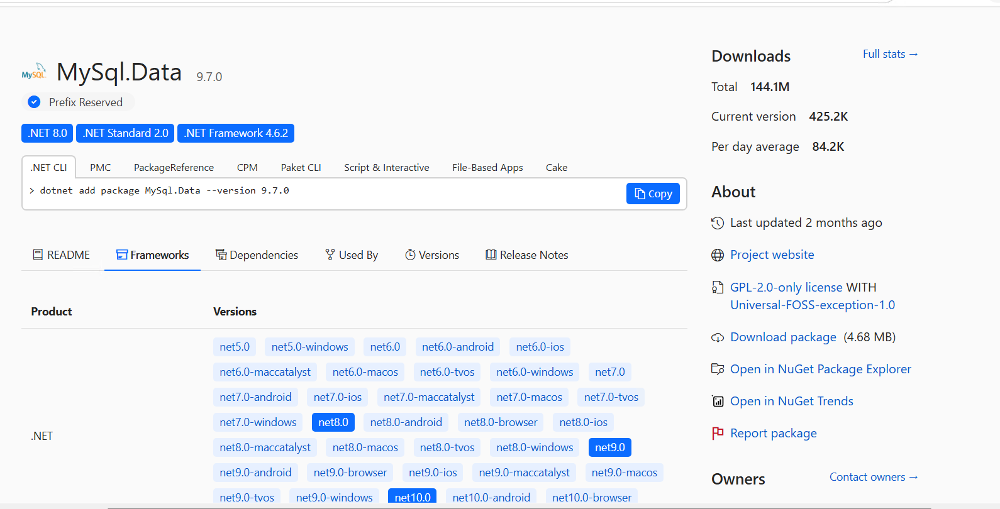

[www.nuget.org](https://www.nuget.org/api/v2/package/MySql.Data/9.7.0)

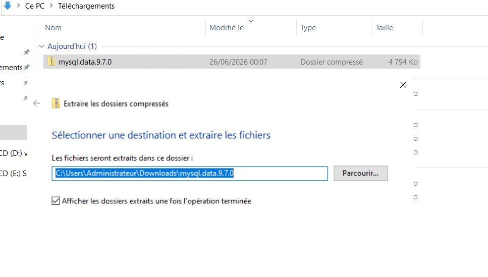

### Créer le dossier et poser les fichiers

1. Sur le Windows Server, je crée un dossier dédié aux scripts  : `C:\Scripts\`.
2. Je place le fichier **`Sync-ADInscriptions.ps1`** dans ce dossier ainsi que le fichier **`MySql.Data.dll`**

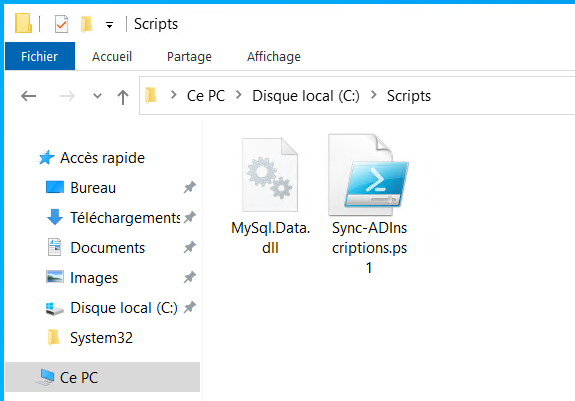

### Configurer le Trigger (Planificateur de tâches)

On veut que le script tourne en arrière-plan toutes les 10 minutes pour récupérer les nouveaux inscrits du site web.

1. Dans **Planificateur de tâches** (`taskschd.msc`).
2. Dans le panneau de droite, clique sur **Créer une tâche...** (pas une tâche de base).
3. **Onglet Général :**
    - **Nom :** `SyncDB-To-AD`
    - **Options de sécurité :** Le script a besoin des droits Admin pour créer des utilisateurs AD
    
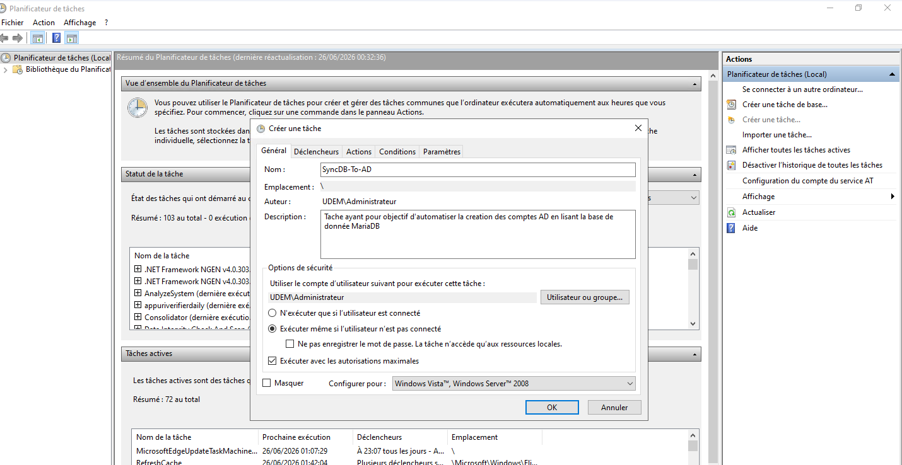
    
4. **Onglet Déclencheurs (Triggers) :**
    - *Idéalement on mettrait juste la période pendant laquelle les inscriptions sont ouvertes*
    
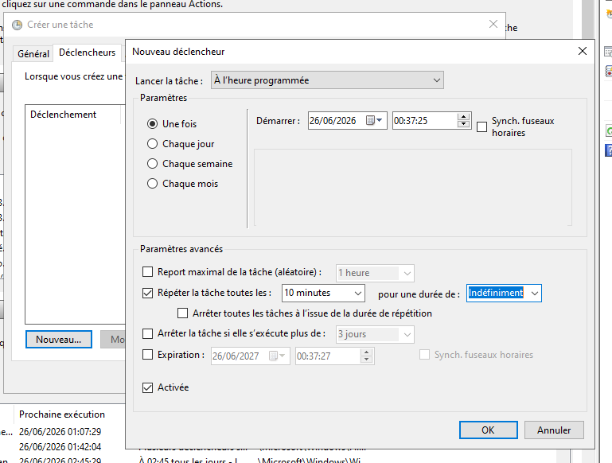
    
5. **Onglet Actions :**
    - **Action :** *Démarrer un programme*.
    - **Programme/script :** `powershell.exe`
    - **Ajouter des arguments (facultatif) :** `ExecutionPolicy Bypass -File "C:\Scripts\Sync-ADInscriptions.ps1"`
    
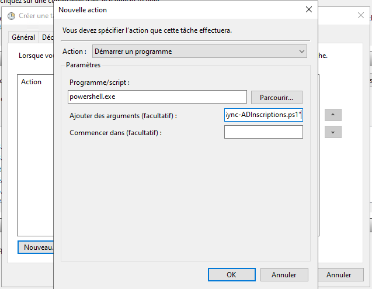
    
6. Valide la création de la tâche. Windows demande le mot de passe de le compte `Administrateur` du domaine pour enregistrer les droits.

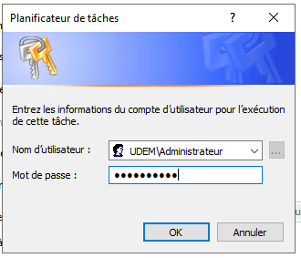

<aside>
⚙

TEST

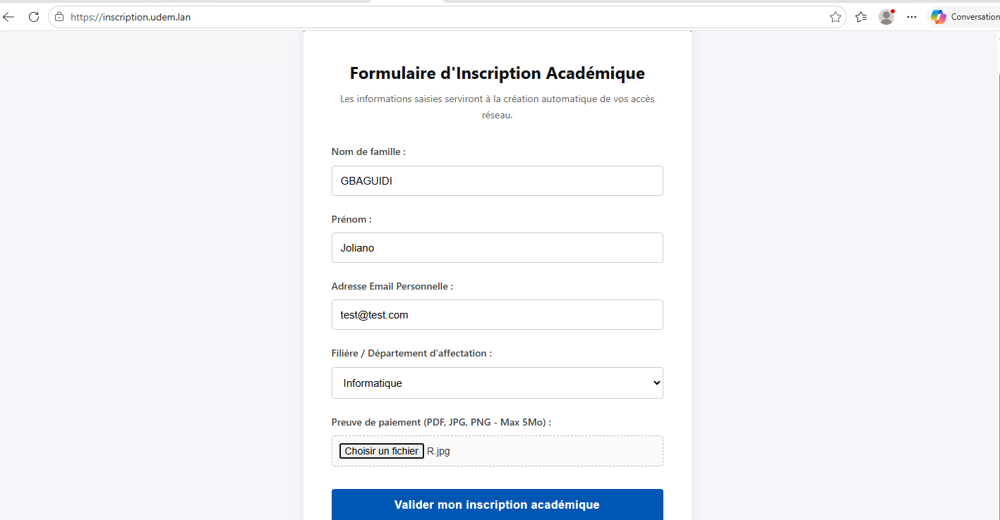

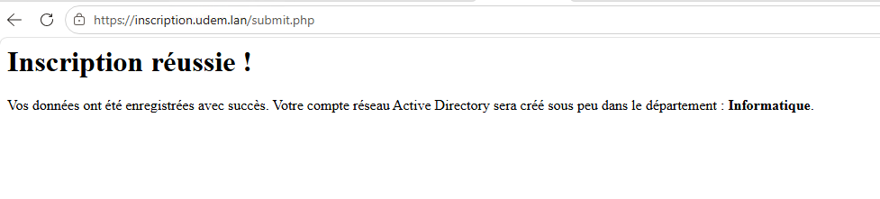

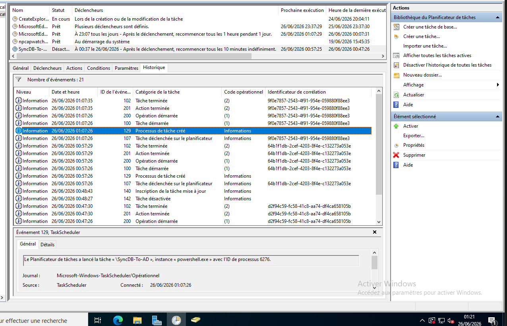

Tache exécuté mais aucun compte créé. Troubleshoot

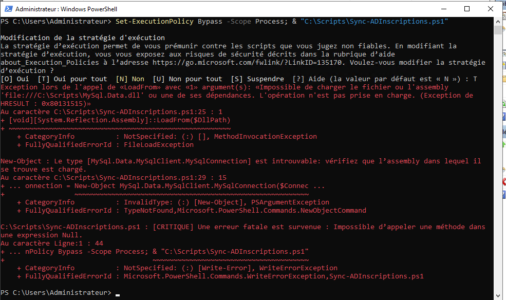

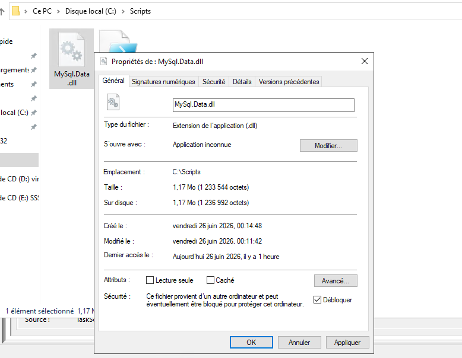

Je recherhc edonc un Connector qui est adapté a mariaDb

Voila celui utilisé tantot, en lisant, il ne repond pas aux attentes

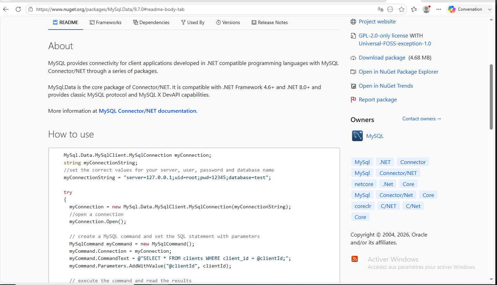

J’ai cherhcé et trouvé celui là

[MySqlConnector 2.6.1](https://www.nuget.org/packages/MySqlConnector)

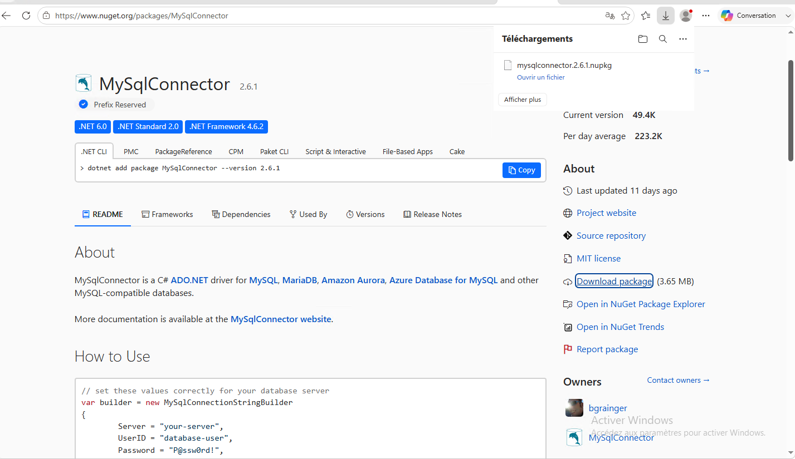

Tu en adaptant le scripts powershell avec les bonnes commandes 

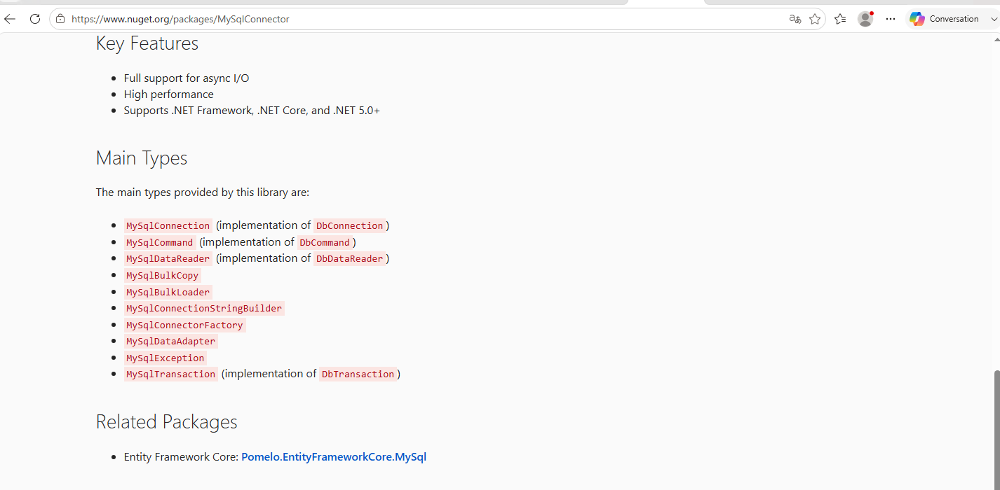

On reprends donc la meme procédure de décompression dans le dossier scripts avec ce connecteur 

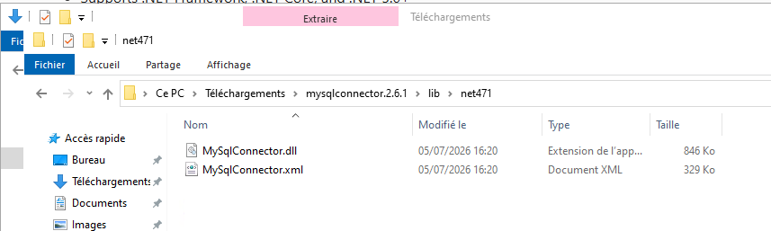

On copie le fichier .dll dans le dossier script et on débloque la sécurité dans Propriétés pour permettre au script d’utiliser le ficher … ca n’a pas été tout. 

Rapport détaillé : </aside>

---

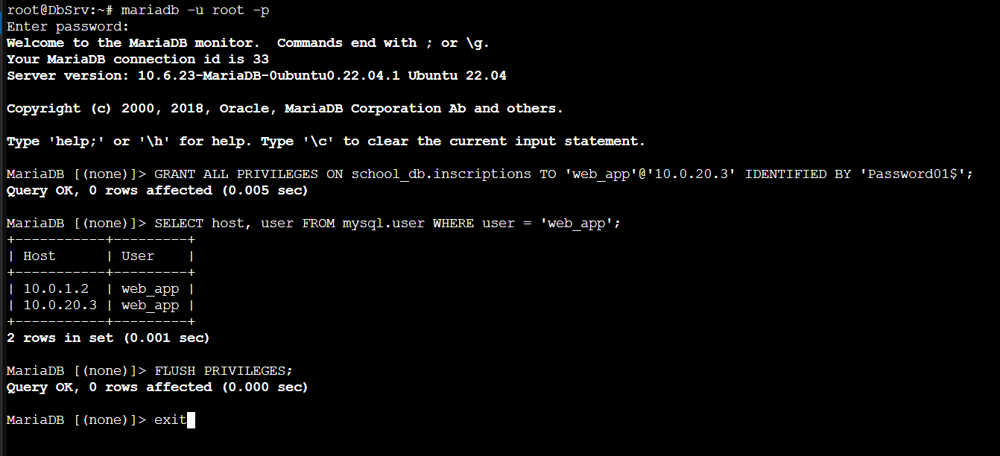

Rappelons l’architecture en 2-Tiers mise en place pour garder la Base de données isolés, le ping depuis le WinServer vers la DbServer ne se rend pas directement. J’illustre


<aside>
⚙

WinServer (10.0.20.10) → (10.0.20.3) WebSer (10.0.1.2) → (10.0.1.3) DbServer

         |———————————>(PING)>———————————|

</aside>

Il faut donc trouver un moyen de faire en sorte que le serveur web passe les cred de login venant du winserver à la base de donnes en gardant les IP. On peut configurer une sorte de Proxy SQL, on peut aussi opter pour configurer le WebServer comme un routeur mais ceci n’est pas sécuritaire

<aside>
⚙

### Configuration de proxy SQL  sur le WebServer (10.0.20.3)

`nano /etc/nginx/nginx.conf`
Et completement en bas du fichier ajouter les directives suivantes et enregistrer

```bash
stream {
    upstream mariadb_backend {
        server 10.0.1.3:3306;
    }

    server {
        listen 3306;
        proxy_pass mariadb_backend;
        proxy_timeout 10m;
        proxy_connect_timeout 5s;
    }
}
```
*📄 Fichier complet : [`code/phase-5-automatisation-powershell/01-configuration-de-proxy-sql-sur-le-webserver-1.sh`](../code/phase-5-automatisation-powershell/01-configuration-de-proxy-sql-sur-le-webserver-1.sh)*

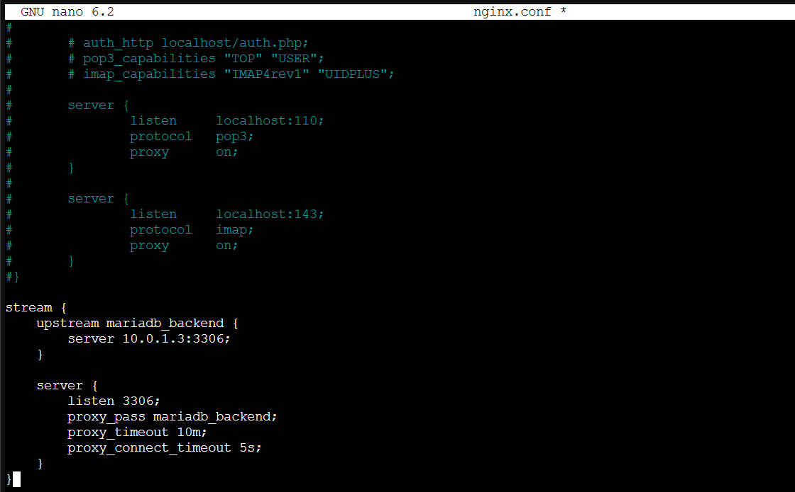

Tester et redemarrer le service 

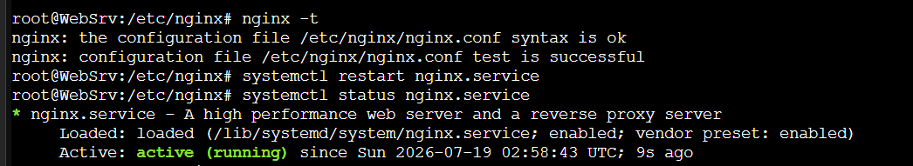

Dans le script PS, on garde l'IP `$DBServer = "10.0.20.3"` 

</aside>

Meme apres ca, la connexion echoue toujours, j’ai consulté les logs de mariadb

```bash
root@DbSrv:~# systemctl status mariadb.s
Unit mariadb.s.service could not be found.
root@DbSrv:~# systemctl status mariadb  
* mariadb.service - MariaDB 10.6.23 database server
     Loaded: loaded (/lib/systemd/system/mariadb.service; enabled; vendor preset: enabled)
     Active: active (running) since Sun 2026-07-19 02:11:49 UTC; 1h 14min ago
       Docs: man:mariadbd(8)
             https://mariadb.com/kb/en/library/systemd/
    Process: 166 ExecStartPre=/usr/bin/install -m 755 -o mysql -g root -d /var/run/mysqld (code=exited, status=0/SUCCESS)
    Process: 171 ExecStartPre=/bin/sh -c systemctl unset-environment _WSREP_START_POSITION (code=exited, status=0/SUCCESS)
    Process: 173 ExecStartPre=/bin/sh -c [ ! -e /usr/bin/galera_recovery ] && VAR= ||   VAR=`/usr/bin/galera_recovery`; [ $?>
    Process: 222 ExecStartPost=/bin/sh -c systemctl unset-environment _WSREP_START_POSITION (code=exited, status=0/SUCCESS)
    Process: 224 ExecStartPost=/etc/mysql/debian-start (code=exited, status=0/SUCCESS)
   Main PID: 202 (mariadbd)
     Status: "Taking your SQL requests now..."
      Tasks: 10 (limit: 61261)
     Memory: 93.8M
        CPU: 709ms
     CGroup: /system.slice/mariadb.service
             `-202 /usr/sbin/mariadbd
Jul 19 03:04:43 DbSrv mariadbd[202]: 2026-07-19  3:04:43 32 [Warning] IP address '10.0.1.2' could not be resolved: Temporary>
Jul 19 03:04:43 DbSrv mariadbd[202]: 2026-07-19  3:04:43 32 [Warning] Aborted connection 32 to db: 'unconnected' user: 'unau>
Jul 19 03:10:44 DbSrv mariadbd[202]: 2026-07-19  3:10:44 33 [Warning] IP address '10.0.1.2' could not be resolved: Temporary>
Jul 19 03:10:54 DbSrv mariadbd[202]: 2026-07-19  3:10:54 33 [Warning] Aborted connection 33 to db: 'unconnected' user: 'unau>
Jul 19 03:21:12 DbSrv mariadbd[202]: 2026-07-19  3:21:12 34 [Warning] IP address '10.0.1.2' could not be resolved: Temporary>
Jul 19 03:21:15 DbSrv mariadbd[202]: 2026-07-19  3:21:15 35 [Warning] IP address '10.0.1.2' could not be resolved: Temporary>
Jul 19 03:21:17 DbSrv mariadbd[202]: 2026-07-19  3:21:17 34 [Warning] Aborted connection 34 to db: 'unconnected' user: 'unau>
Jul 19 03:21:17 DbSrv mariadbd[202]: 2026-07-19  3:21:17 35 [Warning] Aborted connection 35 to db: 'unconnected' user: 'unau>
Jul 19 03:21:23 DbSrv mariadbd[202]: 2026-07-19  3:21:23 36 [Warning] IP address '10.0.1.2' could not be resolved: Temporary>
Jul 19 03:21:33 DbSrv mariadbd[202]: 2026-07-19  3:21:33 36 [Warning] Aborted connection 36 to db: 'unconnected' user: 'unau>
lines 1-28/28 (END)
root@DbSrv:~# 
```
*📄 Fichier complet : [`code/phase-5-automatisation-powershell/02-configuration-de-proxy-sql-sur-le-webserver-1-2.sh`](../code/phase-5-automatisation-powershell/02-configuration-de-proxy-sql-sur-le-webserver-1-2.sh)*

J’ai désactivé la résolution inversé en décommentant “skip-name-resolve” dans le fichier de config. Le problème persistais

J’ai donc décidé de tester une connexion direct avec un logiciel depuis la source et VERDICT

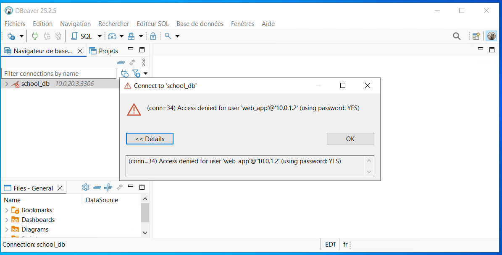

Donc 

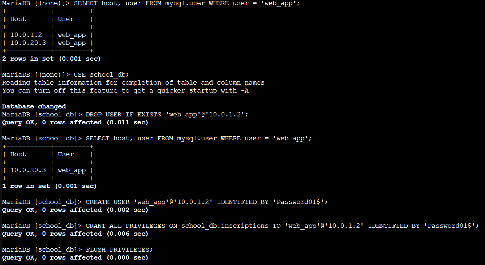

BINGO !!!

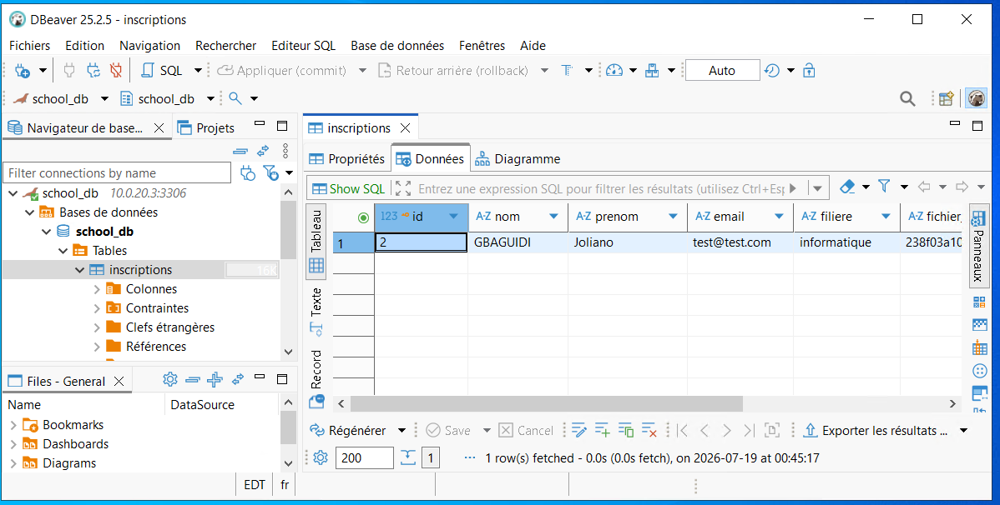

**Dbeaver se connecte mais pas le script , toujours des erreurs Powershell** 

<aside>
⚙

Troubleshoot :</aside>

**L’utilisateur est créé avec un mot de passe généré au hasard qu’il devra changer a la premier connexion. Il est dans l’OU de son programme et son lecteur réseau est mappé**

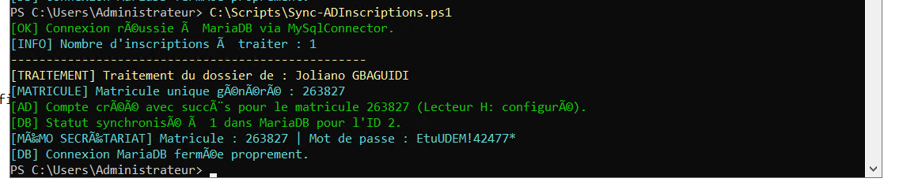

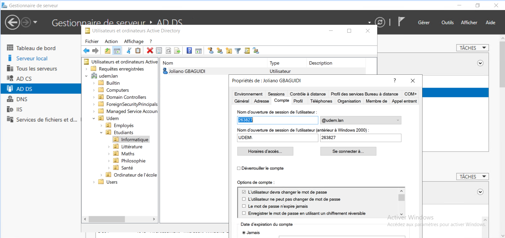

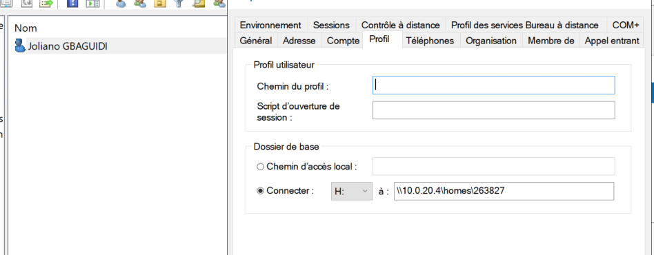

Il faut reconfigurer le trigger (la tache automatisées) afin que tout ceci se passe sans intervention humaine. On l’avait desactivé pour le troubleshooting donc on la configure à nouveau et on  réactive 

Configurer le Trigger (Planificateur de tâches) 

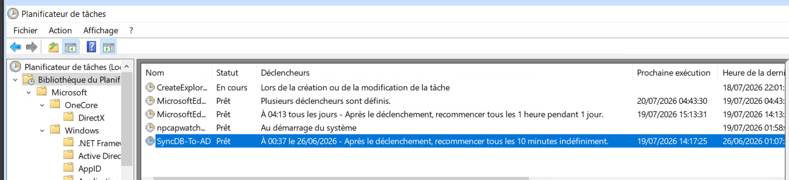

Je teste une nouvel entree dans la base de données pour m’assurer qu’a la prochaine exécution, le compte sera créé 

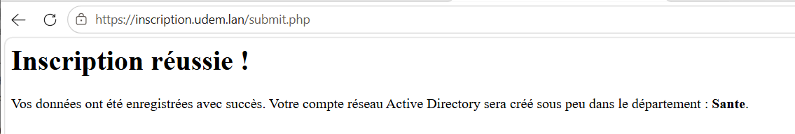

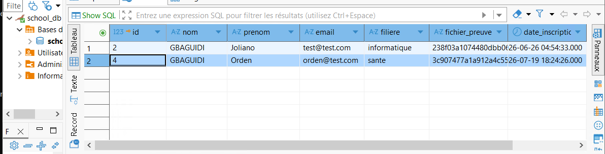

Mais le compte n’est pas créé. Surement un probleme cote automatisation

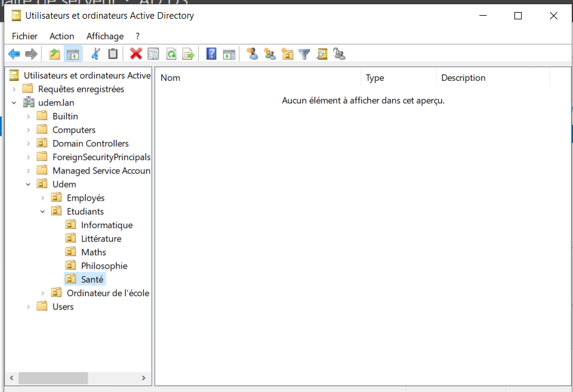

---

La tache se termine avec un resultat bizarre

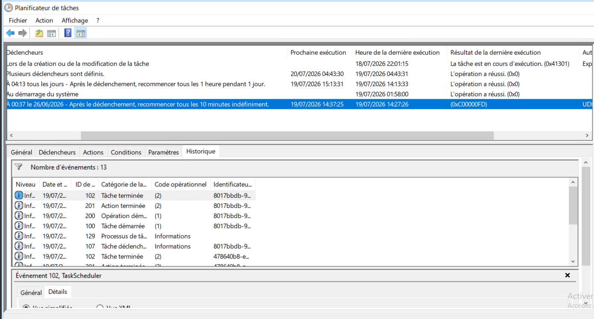

<aside>
⚙

Troobleshooting assisté

</aside>

<aside>
⚙

**COMPTE CREE AVEC SUCCESS DE FACON AUTOMATIQUE**

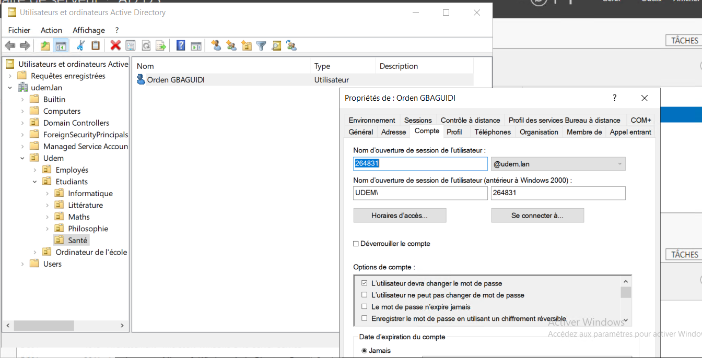

</aside>

#### Scripts Powershell final

```powershell
<#
.SYNOPSIS
    Script d'automatisation V2.8 (MySqlConnector) - Projet École Connectée
    Interroge MariaDB, génère un matricule unique à 6 chiffres, crée le compte AD
    et prépare le mappage du dossier personnel privé (H:) sur le serveur de fichiers Linux.
#>

# ---- TRANSCRIPT : capture toute la sortie console dans un fichier log ----
$LogFolder = "C:\Scripts\logs"
if (-not (Test-Path $LogFolder)) {
    New-Item -Path $LogFolder -ItemType Directory -Force | Out-Null
}
Start-Transcript -Path "$LogFolder\log_$(Get-Date -Format 'yyyyMMdd_HHmmss').txt" -Append

# ---- CHARGEMENT DES DLL : handler AssemblyResolve protégé contre la récursion ----
# NOTE V2.7 : le chargement explicite en boucle (V2.6) exige que le NUMÉRO DE VERSION
# exact de chaque DLL corresponde à ce que MySqlConnector demande (ex: System.Memory
# Version=4.0.1.0) -> échec si le package NuGet téléchargé porte une version différente.
# Le handler AssemblyResolve tolère ces écarts de version (charge le fichier trouvé peu
# importe son numéro exact), MAIS un handler naïf peut se redéclencher lui-même en
# boucle en contexte non-interactif -> stack overflow (0xC00000FD), comme vu en V2.5.
# Solution : un verrou anti-récursion (HashSet) qui empêche le handler de retraiter une
# assembly déjà en cours de résolution.
$script:ResolvingAssemblies = New-Object 'System.Collections.Generic.HashSet[string]'

$onResolve = [System.ResolveEventHandler]{
    param($senderObj, $resolveArgs)
    $simpleName = ([System.Reflection.AssemblyName]$resolveArgs.Name).Name
    if ($script:ResolvingAssemblies.Contains($simpleName)) {
        return $null   # Déjà en cours de résolution -> on coupe la boucle ici
    }
    [void]$script:ResolvingAssemblies.Add($simpleName)
    try {
        $path = "C:\Scripts\$simpleName.dll"
        if (Test-Path $path) {
            return [System.Reflection.Assembly]::LoadFrom($path)
        }
        return $null
    } finally {
        [void]$script:ResolvingAssemblies.Remove($simpleName)
    }
}
[AppDomain]::CurrentDomain.add_AssemblyResolve($onResolve)

# Chargement initial de MySqlConnector.dll : c'est le seul chargement manuel nécessaire,
# le handler ci-dessus résout automatiquement toutes ses dépendances transitives à la demande.
$DllPath = "C:\Scripts\MySqlConnector.dll"
if (-not (Test-Path $DllPath)) {
    Write-Error "[CRITIQUE] DLL manquante : $DllPath"
    Stop-Transcript
    Exit 1
}
[void][System.Reflection.Assembly]::LoadFrom($DllPath)

# --- CONFIGURATION INDISPENSABLE ---
#$DBServer      = "10.0.1.3"         # IP privée de ton conteneur MariaDB (bridge vmbr2)
$DBServer 	= "10.0.20.3" 	     # Ne vise pas l'IP interne 10.0.1.3, vise l'IP d'écoute de ton WebSrv !
$DBDatabase     = "school_db"        # Nom de ta base de données
$DBUser         = "web_app"          # Utilisateur SQL
$DBPass         = "Password01$"      # Mot de passe SQL
$DomainDN       = "DC=udem,DC=lan"   # Distinguished Name du domaine AD

# --- CONFIGURATION DU SERVEUR DE FICHIERS LINUX SMB ---
$FileServerIP   = "10.0.20.4"        # IP  conteneur Ubuntu FileServer SMB
$HomeFolderUNC  = "\\$FileServerIP\homes\"

# --- CHAÎNE DE CONNEXION ---
$ConnectionString = "Server=$DBServer;Database=$DBDatabase;Uid=$DBUser;Pwd=$DBPass;SslMode=None;ConnectionTimeout=30;"

try {
    # La création de l'objet est DANS le try, avec -ErrorAction Stop, pour ne jamais
    # laisser $Connection à $null silencieusement en cas de chaîne de connexion invalide.
    $Connection = New-Object MySqlConnector.MySqlConnection($ConnectionString) -ErrorAction Stop
    $Connection.Open()
    Write-Host "[OK] Connexion réussie à MariaDB via MySqlConnector." -ForegroundColor Green

    # Extraction des seules inscriptions en attente (statut_ad = 0)
    $Query = "SELECT id, nom, prenom, email, filiere FROM inscriptions WHERE statut_ad = 0"
    $Command = New-Object MySqlConnector.MySqlCommand($Query, $Connection)
    $DataAdapter = New-Object MySqlConnector.MySqlDataAdapter($Command)
    $DataTable = New-Object System.Data.DataTable
    [void]$DataAdapter.Fill($DataTable)

    Write-Host "[INFO] Nombre d'inscriptions à traiter : $($DataTable.Rows.Count)" -ForegroundColor Cyan

    # --- TRAITEMENT CHAQUE ÉTUDIANT ---
    foreach ($Row in $DataTable.Rows) {
        $ID       = $Row["id"]
        $Nom      = $Row["nom"]      
        $Prenom   = $Row["prenom"]   
        $Email    = $Row["email"]
        $Filiere  = $Row["filiere"]  

        Write-Host "--------------------------------------------------" -ForegroundColor Yellow
        Write-Host "[TRAITEMENT] Traitement du dossier de : $Prenom $Nom" -ForegroundColor Yellow

        # 1. GÉNÉRATION DU MATRICULE UNIQUE À 6 CHIFFRES
        $IsUnique = $false
        $Matricule = ""
        while (-not $IsUnique) {
            $RandomDigits = Get-Random -Minimum 1000 -Maximum 9999
            $Matricule = "26" + $RandomDigits 
            if (-not (Get-ADUser -Filter "SamAccountName -eq '$Matricule'")) {
                $IsUnique = $true
            }
        }
        Write-Host "[MATRICULE] Matricule unique généré : $Matricule" -ForegroundColor Cyan

        # 2. OU CIBLE & GROUPES DE SÉCURITÉ SÉLECTIONNÉS
        $OU_Filiere = switch ($Filiere) {
            "informatique" { "OU=Informatique,OU=Etudiants,OU=Udem,$DomainDN" }
            "sante"        { "OU=Santé,OU=Etudiants,OU=Udem,$DomainDN" }
            "litterature"  { "OU=Littérature,OU=Etudiants,OU=Udem,$DomainDN" }
            "philosophie"  { "OU=Philosophie,OU=Etudiants,OU=Udem,$DomainDN" }
            "maths"        { "OU=Maths,OU=Etudiants,OU=Udem,$DomainDN" }
        }
        
        $GroupCible = switch ($Filiere) {
            "informatique" { "Group Etu info" }
            "sante"        { "Group Etu Santé" }
            "litterature"  { "Group Etu Litté" }
            "philosophie"  { "Group Etu Philo" }
            "maths"        { "Group Etu Maths" }
        }

        # 3. CONCEPTION DU MOT DE PASSE INITIAL SÉCURISÉ
        $PasswordClair = "EtuUDEM!" + (Get-Random -Minimum 10000 -Maximum 99999) + "*"
        $SecurePassword = ConvertTo-SecureString $PasswordClair -AsPlainText -Force

        # 4. CONFIGURATION DES ATTRIBUTS DE L'UTILISATEUR AD
        $UserParams = @{
            Name                  = "$Prenom $Nom"
            SamAccountName        = $Matricule              
            UserPrincipalName     = "$Matricule@udem.lan"   
            GivenName             = $Prenom
            Surname               = $Nom
            EmailAddress          = $Email
            Path                  = $OU_Filiere             
            AccountPassword       = $SecurePassword
            ChangePasswordAtLogon = $true                   
            Enabled               = $true                   
            
            # Mappage automatique du stockage Linux
            HomeDrive             = "H:"                        
            HomeDirectory         = "$HomeFolderUNC$Matricule"  
        }

        try {
            # Création du compte dans l'Active Directory
            New-ADUser @UserParams
            Write-Host "[AD] Compte créé avec succès pour le matricule $Matricule (Lecteur H: configuré)." -ForegroundColor Green

            # Rattachement au groupe global de sa filière
            if ($GroupCible -and (Get-ADGroup -Filter "Name -eq '$GroupCible'")) {
                Add-ADGroupMember -Identity $GroupCible -Members $Matricule
                Write-Host "[AD] Utilisateur ajouté au groupe : $GroupCible" -ForegroundColor Green
            }

            # 5. MISE À JOUR DU FLAG DANS LA BASE MARIADB BACKEND
            $UpdateQuery = "UPDATE inscriptions SET statut_ad = 1 WHERE id = @id"
            $UpdateCmd = New-Object MySqlConnector.MySqlCommand($UpdateQuery, $Connection)
            [void]$UpdateCmd.Parameters.AddWithValue("@id", $ID)
            [void]$UpdateCmd.ExecuteNonQuery()

            Write-Host "[DB] Statut synchronisé à 1 dans MariaDB pour l'ID $ID." -ForegroundColor Green
            Write-Host "[MÉMO SECRÉTARIAT] Matricule : $Matricule | Mot de passe : $PasswordClair" -ForegroundColor Cyan

        } catch {
            Write-Host "[ERREUR SYSTEM] Échec de la création pour l'étudiant ID $ID :" -ForegroundColor Red
            Write-Host $_.Exception.Message -ForegroundColor Red
            $innerAD = $_.Exception.InnerException
            while ($innerAD) {
                Write-Host $innerAD.GetType().FullName -ForegroundColor Yellow
                Write-Host $innerAD.Message
                $innerAD = $innerAD.InnerException
            }
        }
    }

} catch [System.Exception] {
    Write-Host "=== [CRITIQUE] Message principal ===" -ForegroundColor Red
    Write-Host $_.Exception.Message -ForegroundColor Red

    Write-Host "=== InnerException(s) ===" -ForegroundColor Red
    $inner = $_.Exception.InnerException
    while ($inner) {
        Write-Host $inner.GetType().FullName -ForegroundColor Yellow
        Write-Host $inner.Message
        $inner = $inner.InnerException
    }
} finally {
    if ($Connection -and $Connection.State -eq [System.Data.ConnectionState]::Open) {
        $Connection.Close()
        Write-Host "[DB] Connexion MariaDB fermée proprement." -ForegroundColor Cyan
    }
    Stop-Transcript
}
```
*📄 Fichier complet : [`code/phase-5-automatisation-powershell/03-configuration-de-proxy-sql-sur-le-webserver-1-3.ps1`](../code/phase-5-automatisation-powershell/03-configuration-de-proxy-sql-sur-le-webserver-1-3.ps1)*

## Automatiser la jonction des pc clients au domaine

### Le réseau

Deux win10 sont installés dans l’infra. Une dans le vlan 10 donc Etudiants et l’autre dans le vlan 30 donc Profs. On va les prestage et les joindre au domaine de facon automatique. Dans une grande infra, personne ne joint manuellement 100 ordinateurs au domaine. Donc…on active le DHCP server sur ce vlan , on l’avait déja configuré

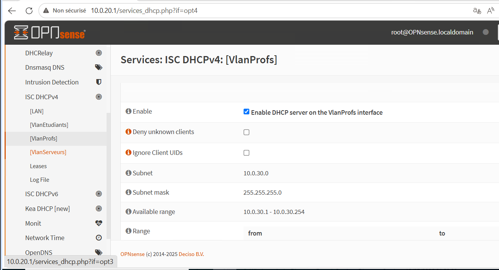

Donc un ordinateur directement branché sur ce vlan qui représente un switch physique recoit une ip directement 

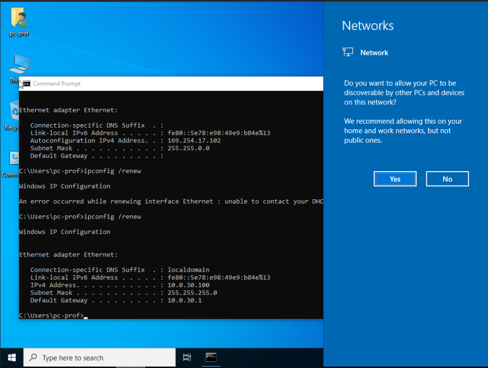

Cependant il n’arrive pas a ping le dns server ou le WinServer 

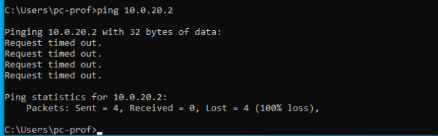

Surement une regle Allow manquante

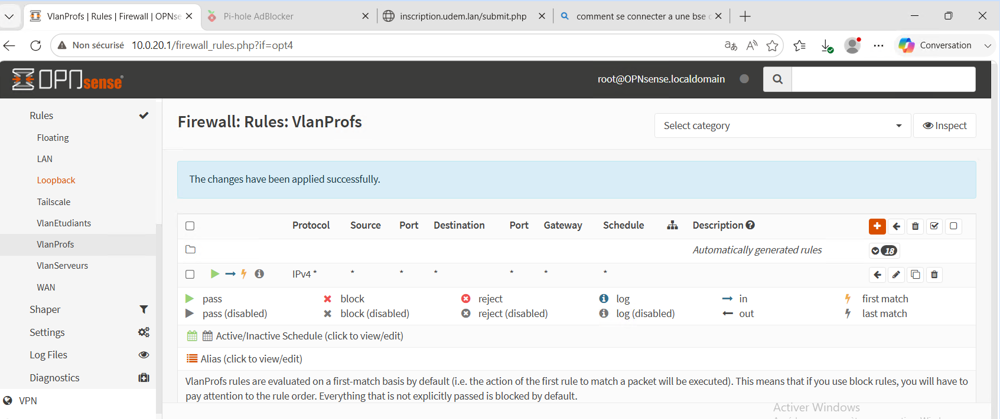

On peut juste mettre cette règle et supprimer les autres qu’on avait créé. On donne accès a tout aux profs, enfin, aux ordinateurs des profs

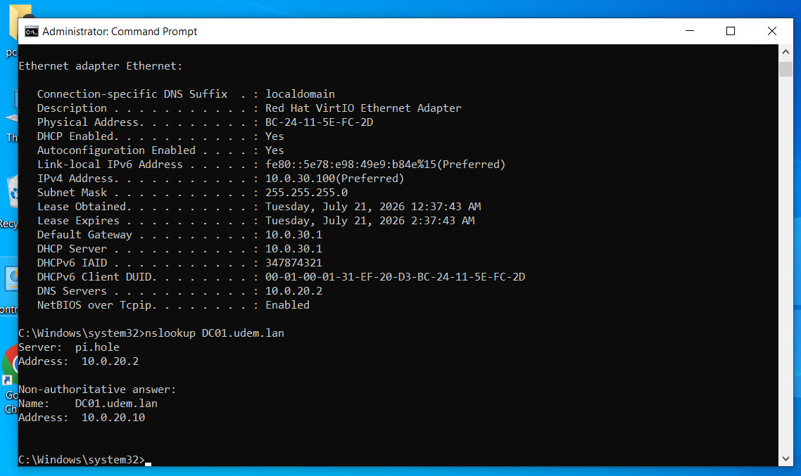

**De ce fait, tout ordinateur qui sera branché sur un VNet se verra allouer une IP et les informations réseaux du vlan donc le DNS qui sera indispensable à la jonction au domaine**

### Pré-stager les comptes ordinateurs dans AD

#### OU et Postes

2 sous-OU , ca aidera a l’application des GPO

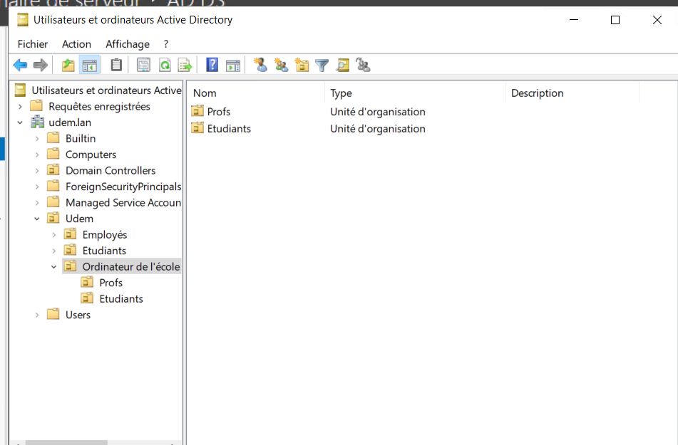

Le but est de tout automatiser donc, on utilise un ficher .csv qui servira comme inventaires des postes disponibles a joindre au domaine. On débloque le fichier csv pour le rendre utilisable par l’automatisation et on le met dans un dossier. J’ai choisi le dossier `scripts`

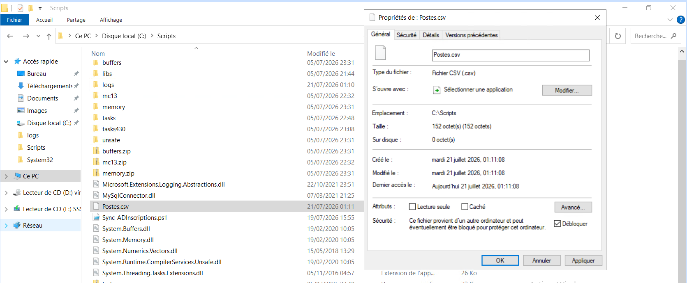

Contenu du fichier .csv

```xml
Nom,OU
PC-ETU-01,"OU=Etudiants,OU=Ordinateur de l'école,OU=Udem,DC=udem,DC=lan"
PC-PROF-01,"OU=Profs,OU=Ordinateur de l'école,OU=Udem,DC=udem,DC=lan"
```
*📄 Fichier complet : [`code/phase-5-automatisation-powershell/04-pre-stager-les-comptes-ordinateurs-dans-ad.xml`](../code/phase-5-automatisation-powershell/04-pre-stager-les-comptes-ordinateurs-dans-ad.xml)*

#### Création de comptes objets par Powershell

Débloquer le fichier 

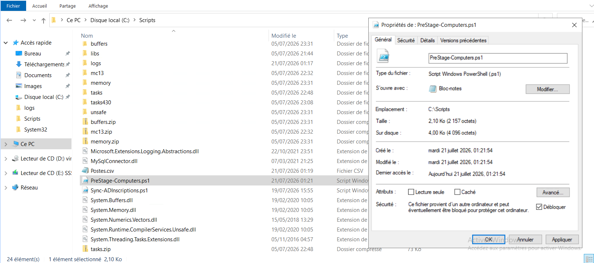

```powershell
<#
.SYNOPSIS
    Pré-staging en masse des comptes ordinateur Active Directory - Projet École Connectée
    Lit un CSV (Nom, OU) et crée les comptes ordinateur correspondants dans AD,
    prêts à être joints par les postes Windows 10 (Add-Computer ou Offline Domain Join).
#>

# ---- TRANSCRIPT ----
$LogFolder = "C:\Scripts\logs"
if (-not (Test-Path $LogFolder)) {
    New-Item -Path $LogFolder -ItemType Directory -Force | Out-Null
}
Start-Transcript -Path "$LogFolder\prestage_$(Get-Date -Format 'yyyyMMdd_HHmmss').txt" -Append

# ---- CONFIGURATION ----
$CsvPath = "C:\Scripts\Postes.csv"

if (-not (Test-Path $CsvPath)) {
    Write-Error "[CRITIQUE] Fichier CSV introuvable : $CsvPath"
    Stop-Transcript
    Exit 1
}

$Postes = Import-Csv -Path $CsvPath

Write-Host "[INFO] Nombre de postes à pré-stager : $($Postes.Count)" -ForegroundColor Cyan

foreach ($Poste in $Postes) {
    $Nom = $Poste.Nom
    $OU  = $Poste.OU

    Write-Host "--------------------------------------------------" -ForegroundColor Yellow
    Write-Host "[TRAITEMENT] Poste : $Nom -> $OU" -ForegroundColor Yellow

    try {
        # Vérifie que le compte n'existe pas déjà (pas de doublon)
        if (Get-ADComputer -Filter "Name -eq '$Nom'" -ErrorAction SilentlyContinue) {
            Write-Host "[SKIP] Le compte $Nom existe déjà dans AD." -ForegroundColor DarkYellow
            continue
        }

        New-ADComputer -Name $Nom -Path $OU -Enabled $true -ErrorAction Stop
        Write-Host "[AD] Compte ordinateur créé avec succès : $Nom" -ForegroundColor Green

    } catch {
        Write-Host "[ERREUR SYSTEM] Échec de la création pour $Nom :" -ForegroundColor Red
        Write-Host $_.Exception.Message -ForegroundColor Red
        $inner = $_.Exception.InnerException
        while ($inner) {
            Write-Host $inner.GetType().FullName -ForegroundColor Yellow
            Write-Host $inner.Message
            $inner = $inner.InnerException
        }
    }
}

Write-Host "--------------------------------------------------" -ForegroundColor Yellow
Write-Host "[TERMINÉ] Pré-staging terminé." -ForegroundColor Green

Stop-Transcript
```
*📄 Fichier complet : [`code/phase-5-automatisation-powershell/05-pre-stager-les-comptes-ordinateurs-dans-ad-2.ps1`](../code/phase-5-automatisation-powershell/05-pre-stager-les-comptes-ordinateurs-dans-ad-2.ps1)*

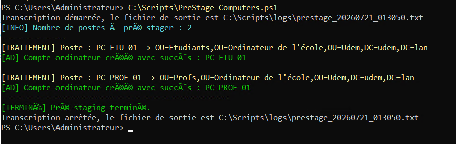

Les comptes ont été automatiquement créé selon le .csv

Si à l’avenir on décide d’agrandir le parc, il suffit de faire de nouvelles entrées dans l’inventaire des postes et exécuter el script à nouveau. En cas de compte déja existant, le script ne crée pas l’objet une seconde fois. La preuve :

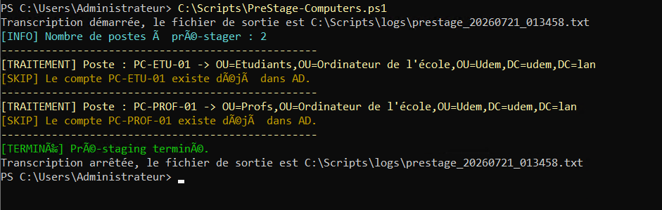

#### Jonction proprement dite

Avec la commade `Add-Computer` à executer sur les postes cibles, en les attributs `-DomainName` et aussi `-NewName` on joint le poste au domaine en le renommant. Ceci nous evite de devoir renommer le poste dans les régalges systemes et nous evite aussi d’avoir des objets Computers avec des noms qu’on n’a pas décider

Sur le poste Profs

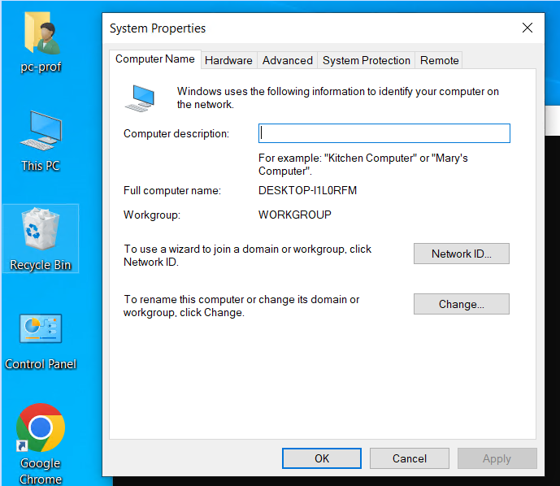

Avant l’exécution du code, le pc est en workgroup et porte un nom random

```powershell
Add-Computer -DomainName "udem.lan" -NewName "PC-PROF-01" -Credential (Get-Credential) -Force -Restart
```
*📄 Fichier complet : [`code/phase-5-automatisation-powershell/06-pre-stager-les-comptes-ordinateurs-dans-ad-3.ps1`](../code/phase-5-automatisation-powershell/06-pre-stager-les-comptes-ordinateurs-dans-ad-3.ps1)*

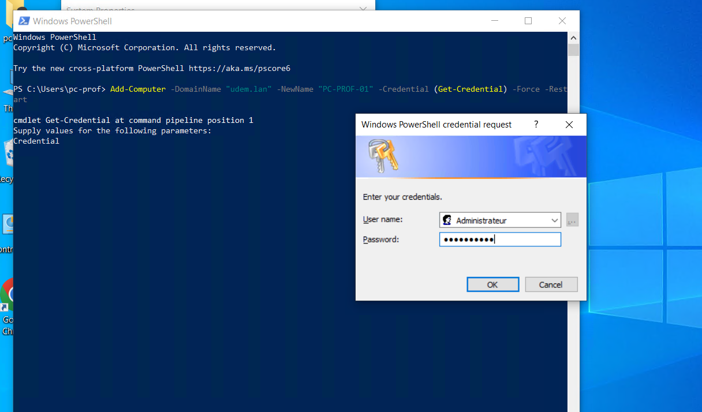

Mais erreur au moment de la jonction 

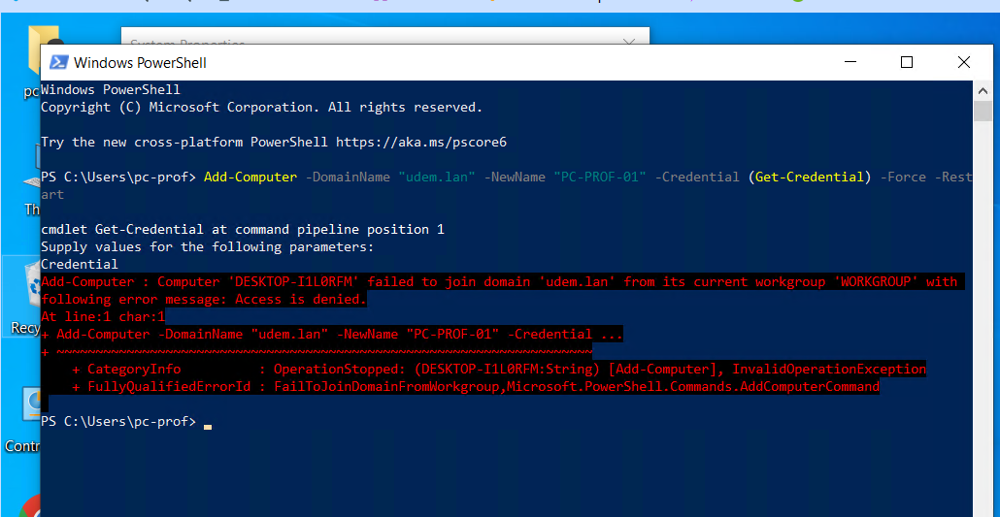

<aside>
⚙

Troubleshoot

</aside>

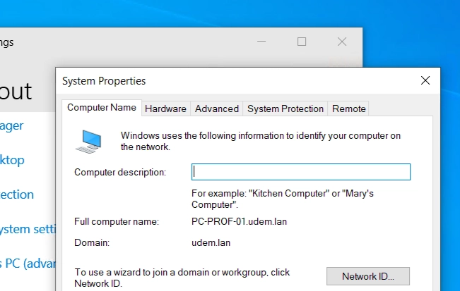

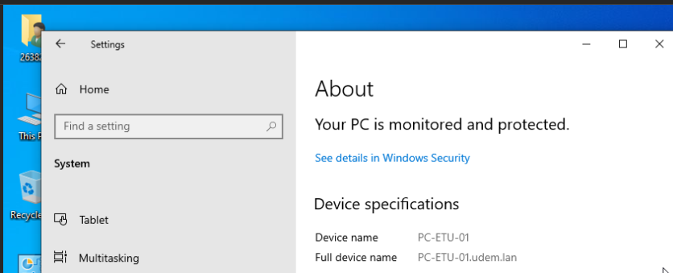

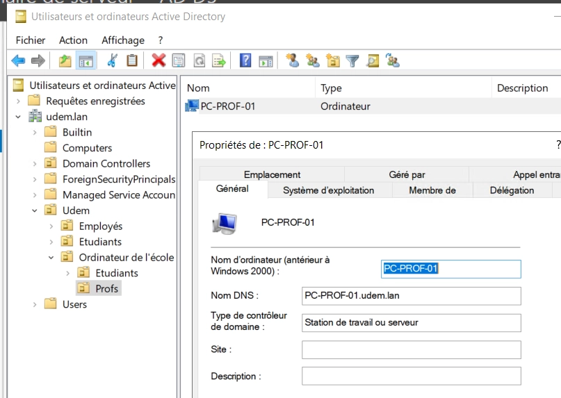

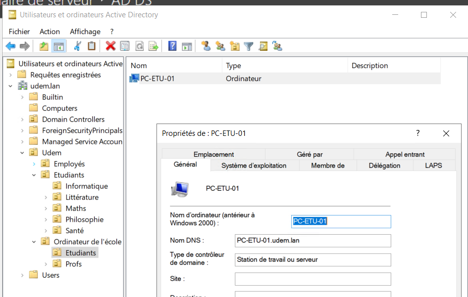

### Première connexion avec un compte étudiant

L’étudiant s’authentifie pour la première fois avec le mot de passe qu’on lui donne mais avant d’ouvrir une session, il doit créer un mot de passe qui lui servira pour ses prochaines fois 

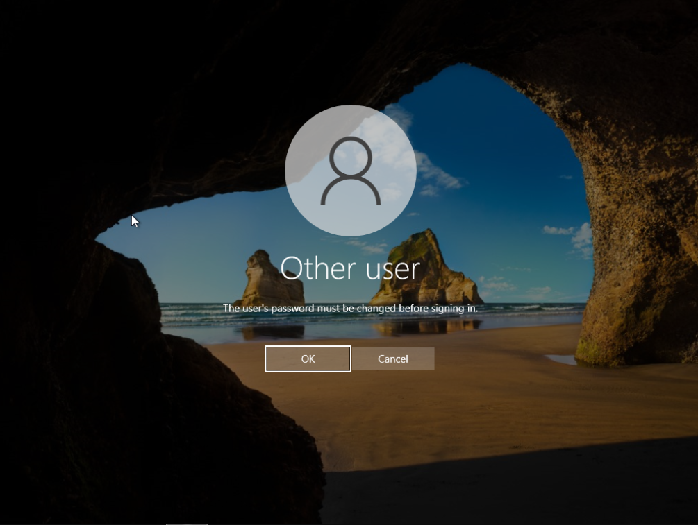

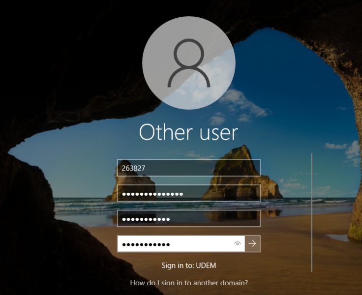

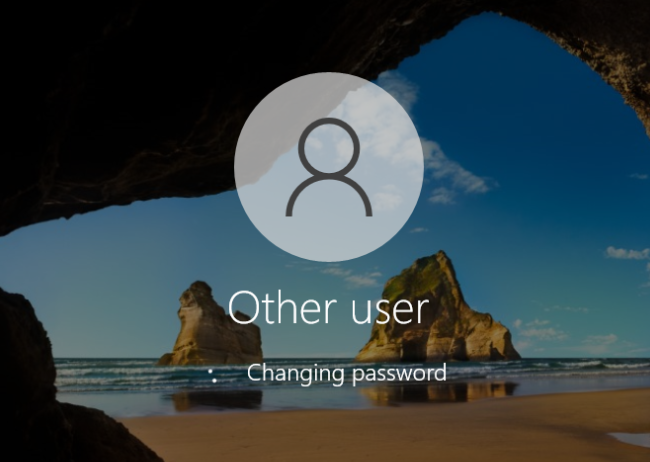

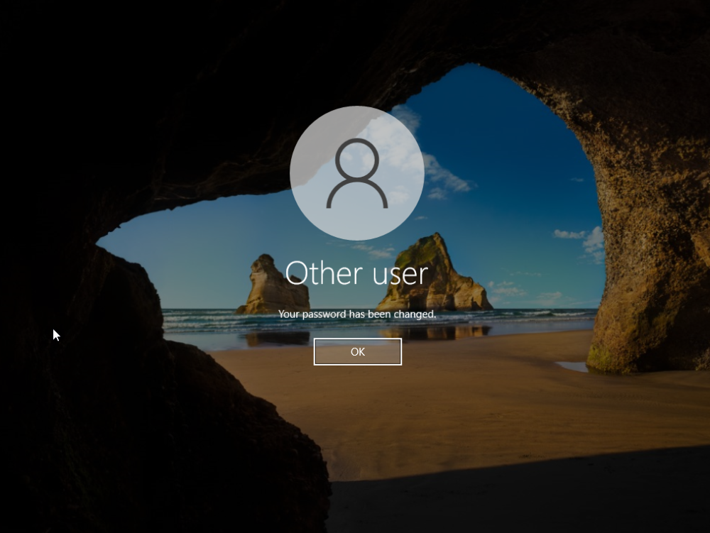
