[← Retour au README](../README.md)

# **Phase 8 — Chatbot IT local**

<aside>
⚙

Chatbot IT local | Proxmox LXC + Ollama + Open WebUI + HTTPS (ADCS)

</aside>

## Architecture finale

```
[Navigateurs des profs & techniciens — VLAN 30]
                    │
               HTTPS :443
                    │
    ┌───────────────┴──────────────────┐
    │  LXC Ubuntu 22.04 — VLAN 30      │
    │  itsupport.udem.lan              │
    │                                  │
    │  ┌─────────────────────────┐     │
    │  │  Nginx (reverse proxy)  │◄─── cert ADCS
    │  └───────────┬─────────────┘     │
    │              │ :3000             │
    │  ┌───────────▼─────────────┐     │
    │  │  Open WebUI             │     │
    │  │  Interface + RAG + Auth │     │
    │  └───────────┬─────────────┘     │
    │              │ :11434            │
    │  ┌───────────▼─────────────┐     │
    │  │  Ollama                 │     │
    │  │  (mistral:7b)           │     │
    │  └─────────────────────────┘     │
    └──────────────────────────────────┘
```
*📄 Fichier complet : [`code/phase-8-chatbot-it-local/01-architecture-finale.txt`](../code/phase-8-chatbot-it-local/01-architecture-finale.txt)*

## **Stack technique :**

| Composant | Technologie | Rôle |
| --- | --- | --- |
| OS | Ubuntu 22.04 LTS (LXC Proxmox) | Système de base |
| LLM Engine | Ollama (via Docker) | Exécute le modèle IA |
| Interface | Open WebUI (via Docker) | Web UI + RAG + gestion users |
| Reverse Proxy | Nginx (natif) | HTTPS + routage |
| Certificat | ADCS (udem.lan) | TLS sans avertissement navigateur |

## Création et configuration du Lxc

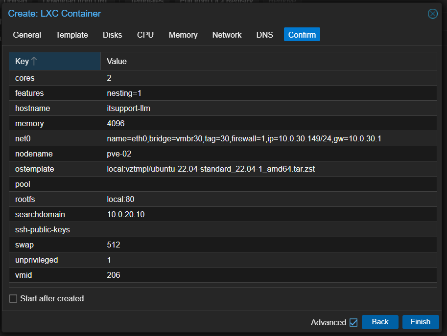

### Vérification de la connectivité

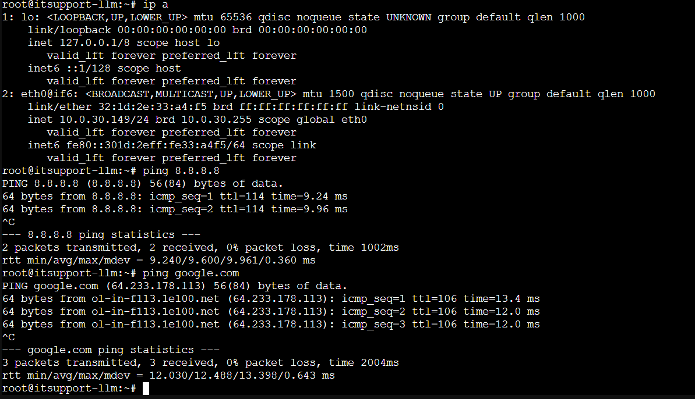

### Mise à jour du système

`apt install -y curl wget git nano ufw net-tools openssl`

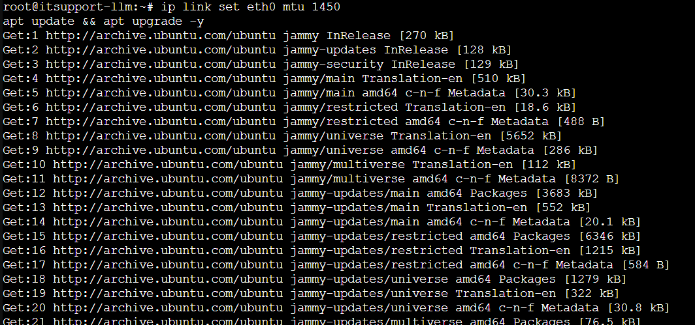

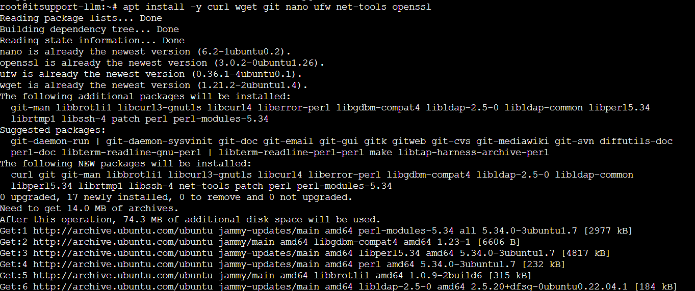

### Configuration du hostname

```bash
hostnamectl set-hostname itsupport-llm
echo "127.0.0.1 itsupport-llm" >> /etc/hosts
```
*📄 Fichier complet : [`code/phase-8-chatbot-it-local/02-configuration-du-hostname.sh`](../code/phase-8-chatbot-it-local/02-configuration-du-hostname.sh)*

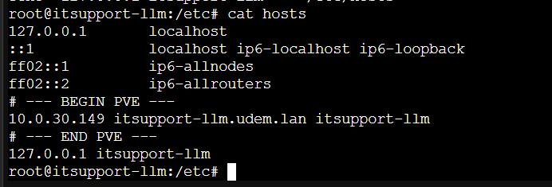

## Installer Docker + Docker Compose

[Install Docker Engine on Ubuntu](https://docs.docker.com/engine/install/ubuntu/)

### Dépendances nécessaires

```bash
apt install -y ca-certificates gnupg lsb-release
```
*📄 Fichier complet : [`code/phase-8-chatbot-it-local/03-dependances-necessaires.sh`](../code/phase-8-chatbot-it-local/03-dependances-necessaires.sh)*

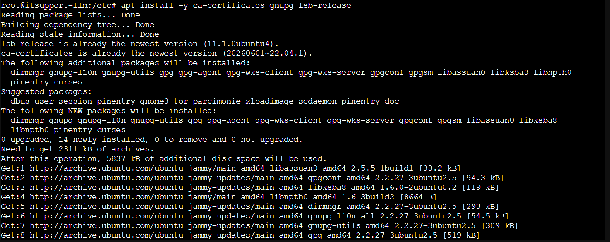

### Clé GPG officielle Docker

```bash
install -m 0755 -d /etc/apt/keyrings
curl -fsSL [https://download.docker.com/linux/ubuntu/gpg](https://download.docker.com/linux/ubuntu/gpg) | \
gpg --dearmor -o /etc/apt/keyrings/docker.gpg
chmod a+r /etc/apt/keyrings/docker.gpg
```
*📄 Fichier complet : [`code/phase-8-chatbot-it-local/04-cle-gpg-officielle-docker.sh`](../code/phase-8-chatbot-it-local/04-cle-gpg-officielle-docker.sh)*

### Ajouter le dépôt Docker

```bash
echo \
"deb [arch=(dpkg --print-architecture) signed-by=/etc/apt/keyrings/docker.gpg] \
  <https://download.docker.com/linux/ubuntu> \(lsb_release -cs) stable" | \
tee /etc/apt/sources.list.d/docker.list > /dev/null
```
*📄 Fichier complet : [`code/phase-8-chatbot-it-local/05-ajouter-le-depot-docker.sh`](../code/phase-8-chatbot-it-local/05-ajouter-le-depot-docker.sh)*

### Installer Docker Engine

```bash
apt update
apt install -y docker-ce docker-ce-cli [containerd.io](http://containerd.io/) \
docker-buildx-plugin docker-compose-plugin
```
*📄 Fichier complet : [`code/phase-8-chatbot-it-local/06-installer-docker-engine.sh`](../code/phase-8-chatbot-it-local/06-installer-docker-engine.sh)*

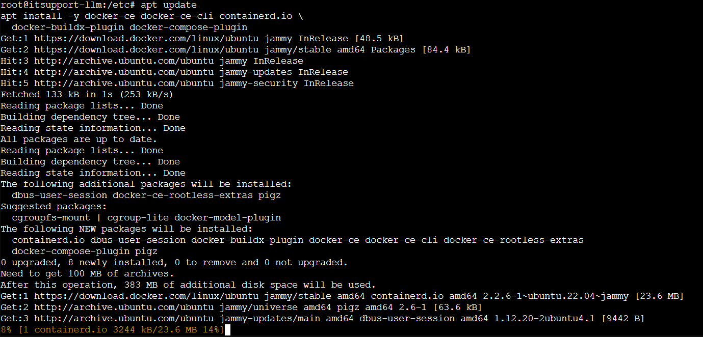

### Activer Docker au démarrage

```bash
systemctl enable docker
systemctl start docker
```
*📄 Fichier complet : [`code/phase-8-chatbot-it-local/07-activer-docker-au-demarrage.sh`](../code/phase-8-chatbot-it-local/07-activer-docker-au-demarrage.sh)*

### Vérifier l'installation

```bash
docker --version
docker compose version
```
*📄 Fichier complet : [`code/phase-8-chatbot-it-local/08-verifier-l-installation.sh`](../code/phase-8-chatbot-it-local/08-verifier-l-installation.sh)*

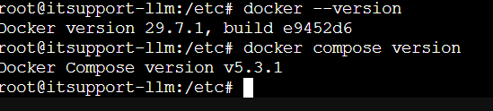

## Créer le fichier Docker Compose

### Créer le répertoire du projet

```bash
mkdir -p /opt/llm-chat
cd /opt/llm-chat
```
*📄 Fichier complet : [`code/phase-8-chatbot-it-local/09-creer-le-repertoire-du-projet.sh`](../code/phase-8-chatbot-it-local/09-creer-le-repertoire-du-projet.sh)*

### Crée le fichier de configuration

```bash
nano /opt/llm-chat/docker-compose.yml
```
*📄 Fichier complet : [`code/phase-8-chatbot-it-local/10-cree-le-fichier-de-configuration.sh`](../code/phase-8-chatbot-it-local/10-cree-le-fichier-de-configuration.sh)*

```yaml
services:
  ollama:
    image: ollama/ollama:latest
    container_name: ollama
    security_opt:
      - apparmor=unconfined
    volumes:
      - ollama_data:/root/.ollama
    ports:
      - "127.0.0.1:11434:11434"
    environment:
      - OLLAMA_NUM_PARALLEL=2
      - OLLAMA_MAX_LOADED_MODELS=1
      - OLLAMA_KEEP_ALIVE=5m
    restart: unless-stopped

  open-webui:
    image: ghcr.io/open-webui/open-webui:main
    container_name: open-webui
    security_opt:
      - apparmor=unconfined
    depends_on:
      - ollama
    volumes:
      - webui_data:/app/backend/data
    ports:
      - "127.0.0.1:3000:8080"
    environment:
      - OLLAMA_BASE_URL=http://ollama:11434
      - WEBUI_NAME=Genie du Reseau UDEM
      - DEFAULT_LOCALE=fr
      - ENABLE_SIGNUP=false
      - WEBUI_AUTH=true
    restart: unless-stopped

volumes:
  ollama_data:
  webui_data:
```
*📄 Fichier complet : [`code/phase-8-chatbot-it-local/11-cree-le-fichier-de-configuration-2.yml`](../code/phase-8-chatbot-it-local/11-cree-le-fichier-de-configuration-2.yml)*

### Démarrer les services

```bash
cd /opt/llm-chat
docker compose up -d
```
*📄 Fichier complet : [`code/phase-8-chatbot-it-local/12-demarrer-les-services.sh`](../code/phase-8-chatbot-it-local/12-demarrer-les-services.sh)*

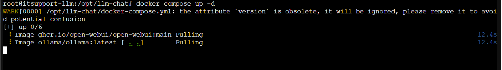

### Vérifier que les conteneurs tournent

```bash
docker compose ps
```
*📄 Fichier complet : [`code/phase-8-chatbot-it-local/13-verifier-que-les-conteneurs-tournent.sh`](../code/phase-8-chatbot-it-local/13-verifier-que-les-conteneurs-tournent.sh)*

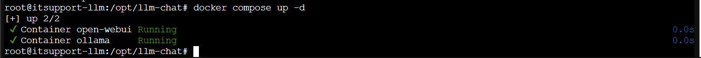

## Télécharger le modèle LLM

```bash
docker exec -it ollama ollama pull llama3.2:3b
```
*📄 Fichier complet : [`code/phase-8-chatbot-it-local/14-telecharger-le-modele-llm.sh`](../code/phase-8-chatbot-it-local/14-telecharger-le-modele-llm.sh)*

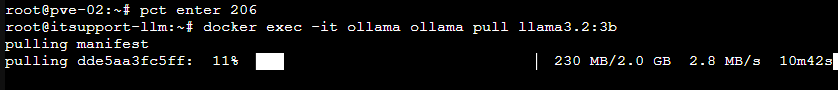

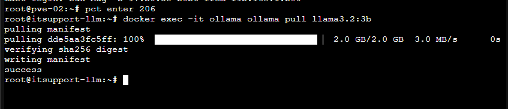

### Vérifier les modèles installés

```bash
docker exec -it ollama ollama list
```
*📄 Fichier complet : [`code/phase-8-chatbot-it-local/15-verifier-les-modeles-installes.sh`](../code/phase-8-chatbot-it-local/15-verifier-les-modeles-installes.sh)*

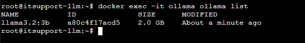

### Test rapide du modèle

```bash
docker exec -it ollama ollama run llama3.2:3b "Bonjour, réponds en une phrase."
```
*📄 Fichier complet : [`code/phase-8-chatbot-it-local/16-test-rapide-du-modele.sh`](../code/phase-8-chatbot-it-local/16-test-rapide-du-modele.sh)*

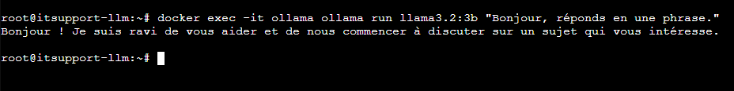

## Installer et configurer Nginx

```bash
apt install -y nginx
```
*📄 Fichier complet : [`code/phase-8-chatbot-it-local/17-installer-et-configurer-nginx.sh`](../code/phase-8-chatbot-it-local/17-installer-et-configurer-nginx.sh)*

### Préparer le répertoire pour les certificats SSL

```bash
mkdir -p /etc/nginx/ssl
chmod 700 /etc/nginx/ssl
```
*📄 Fichier complet : [`code/phase-8-chatbot-it-local/18-preparer-le-repertoire-pour-les-certificats-s.sh`](../code/phase-8-chatbot-it-local/18-preparer-le-repertoire-pour-les-certificats-s.sh)*

### Désactiver le site par défaut de Nginx

```bash
rm -f /etc/nginx/sites-enabled/default
```
*📄 Fichier complet : [`code/phase-8-chatbot-it-local/19-desactiver-le-site-par-defaut-de-nginx.sh`](../code/phase-8-chatbot-it-local/19-desactiver-le-site-par-defaut-de-nginx.sh)*

### Créer la configuration du chatbot

```bash
nano /etc/nginx/sites-available/itsupport
```
*📄 Fichier complet : [`code/phase-8-chatbot-it-local/20-creer-la-configuration-du-chatbot.sh`](../code/phase-8-chatbot-it-local/20-creer-la-configuration-du-chatbot.sh)*

Colle ce contenu :

```bash
#  Redirection 
server {
    listen 80;
    server_name itsupport.udem.lan;
    return 301 https://$server_name$request_uri;
}

#  Serveur HTTPS 
server {
    listen 443 ssl;
    server_name itsupport.udem.lan;

    # Certificats ADCS 
    ssl_certificate     /etc/nginx/ssl/itsupport.crt;
    ssl_certificate_key /etc/nginx/ssl/itsupport.key;

    # Protocoles et chiffrements modernes 
    ssl_protocols TLSv1.2 TLSv1.3;
    ssl_ciphers ECDHE-ECDSA-AES128-GCM-SHA256:ECDHE-RSA-AES128-GCM-SHA256:ECDHE-ECDSA-AES256-GCM-SHA384:ECDHE-RSA-AES256-GCM-SHA384;
    ssl_prefer_server_ciphers off;
    ssl_session_timeout 1d;
    ssl_session_cache shared:SSL:10m;

    # Timeouts élevés pour les réponses LLM
    proxy_read_timeout    600s;
    proxy_connect_timeout  60s;
    proxy_send_timeout    600s;

    location / {
        proxy_pass http://127.0.0.1:3000;
        proxy_http_version 1.1;

        # WebSocket pour le streaming des réponses LLM
        proxy_set_header Upgrade    $http_upgrade;
        proxy_set_header Connection "upgrade";

        # Headers standards
        proxy_set_header Host              $host;
        proxy_set_header X-Real-IP         $remote_addr;
        proxy_set_header X-Forwarded-For   $proxy_add_x_forwarded_for;
        proxy_set_header X-Forwarded-Proto https;

        # Désactiver le buffering 
        proxy_buffering off;
        proxy_cache     off;
    }

```
*📄 Fichier complet : [`code/phase-8-chatbot-it-local/21-creer-la-configuration-du-chatbot-2.sh`](../code/phase-8-chatbot-it-local/21-creer-la-configuration-du-chatbot-2.sh)*

### Activer le site (lien symbolique)

```bash
ln -s /etc/nginx/sites-available/itsupport /etc/nginx/sites-enabled/itsupport
```
*📄 Fichier complet : [`code/phase-8-chatbot-it-local/22-activer-le-site-lien-symbolique.sh`](../code/phase-8-chatbot-it-local/22-activer-le-site-lien-symbolique.sh)*

## Obtenir le certificat depuis l'ADCS

### Générer la CSR depuis le LXC

```bash
mkdir -p /etc/nginx/ssl
cd /etc/nginx/ssl

openssl req -new -newkey rsa:2048 -nodes \
  -keyout itsupport.key \
  -out itsupport.csr \
  -subj "/CN=itsupport.udem.lan/O=UDEM/C=CA"

cat itsupport.csr
```
*📄 Fichier complet : [`code/phase-8-chatbot-it-local/23-generer-la-csr-depuis-le-lxc.sh`](../code/phase-8-chatbot-it-local/23-generer-la-csr-depuis-le-lxc.sh)*

On copie tout le CSR , on l’utilisera sur le Windows Server 

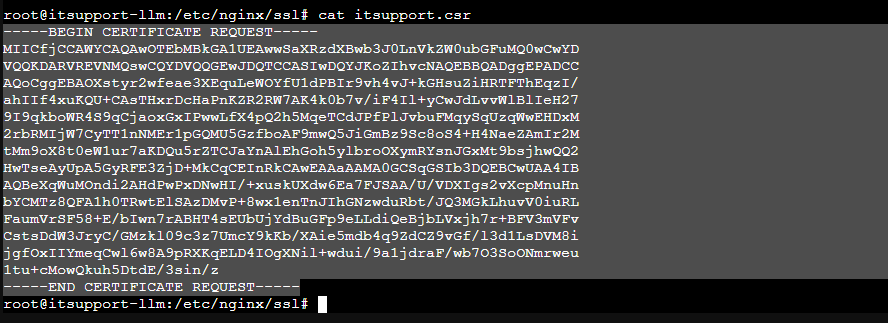

### Soumettre via certsrv

`http://10.0.20.10/certsrv`

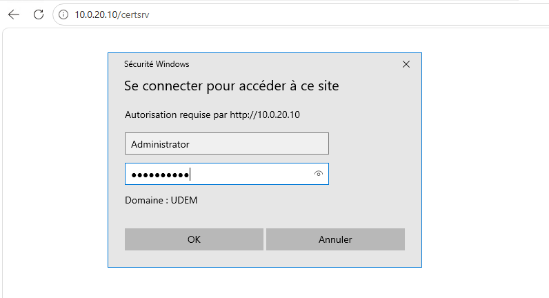

Demander un certificat

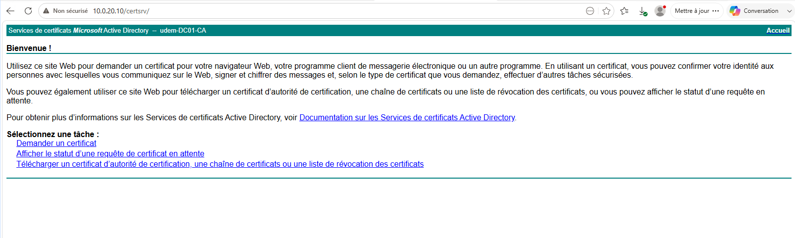

Demande de certificat avancée 

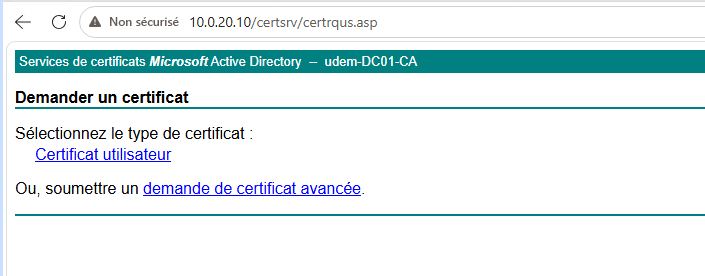

On colle le CSR et on choisit le modèle Web Server 

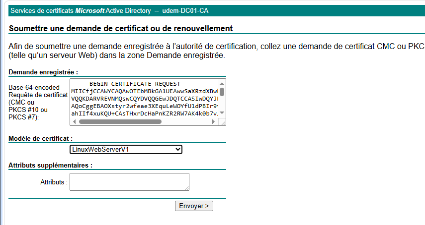

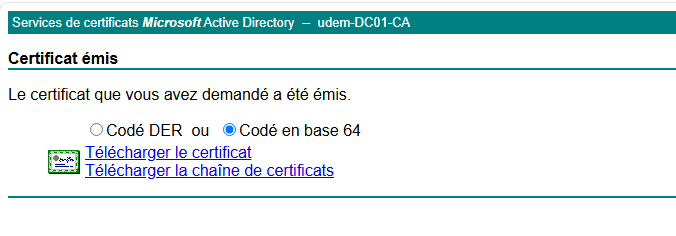

Le certificat est pret 

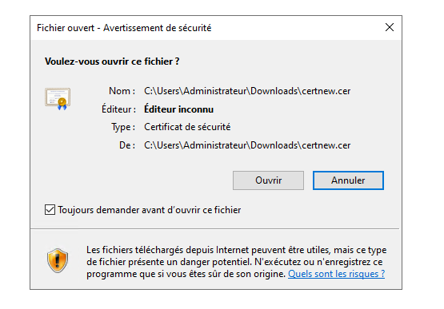

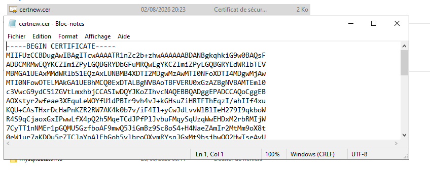

### Transfert sur le serveur Web

```powershell
scp certnew.cer root@10.0.30.149:/etc/nginx/ssl/itsupport.crt
```
*📄 Fichier complet : [`code/phase-8-chatbot-it-local/24-transfert-sur-le-serveur-web.ps1`](../code/phase-8-chatbot-it-local/24-transfert-sur-le-serveur-web.ps1)*

<aside>
⚙

SSH refuse l'authentification par mot de passe.

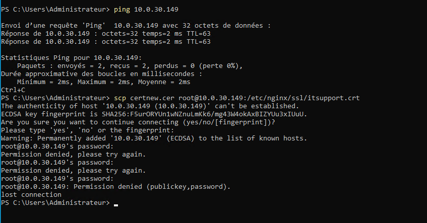

Pour des raisons de securité, on va pas autoriser la connexion avec le compte root par ssh

</aside>

Sur le LXC :

```bash
cat > /etc/nginx/ssl/itsupport.crt << 'EOF'
-----BEGIN CERTIFICATE-----
[Ici je colle le contenu du fichier ]
-----END CERTIFICATE-----
EOF
```
*📄 Fichier complet : [`code/phase-8-chatbot-it-local/25-transfert-sur-le-serveur-web-2.sh`](../code/phase-8-chatbot-it-local/25-transfert-sur-le-serveur-web-2.sh)*

#### Vérifier sur le LXC

```bash
openssl x509 -in /etc/nginx/ssl/itsupport.crt -noout -text | grep -E "Subject:|Not After"
chmod 644 /etc/nginx/ssl/itsupport.crt
chmod 600 /etc/nginx/ssl/itsupport.key
```
*📄 Fichier complet : [`code/phase-8-chatbot-it-local/26-transfert-sur-le-serveur-web-3.sh`](../code/phase-8-chatbot-it-local/26-transfert-sur-le-serveur-web-3.sh)*

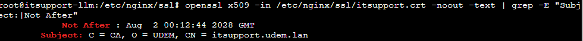

## Démarrer Nginx avec HTTPS

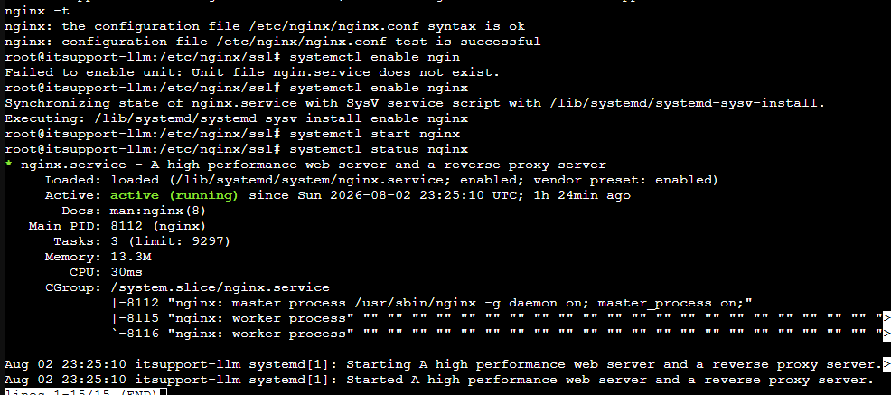

Vérifier les ports http et https

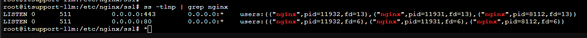

### Configurer le pare-feu UFW

```bash
ufw allow 22/tcp     
ufw allow 80/tcp      
ufw allow 443/tcp    
ufw enable
ufw status
```
*📄 Fichier complet : [`code/phase-8-chatbot-it-local/27-configurer-le-pare-feu-ufw.sh`](../code/phase-8-chatbot-it-local/27-configurer-le-pare-feu-ufw.sh)*

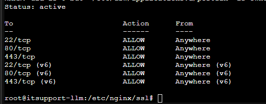

## Créer l'enregistrement DNS interne

### DNS Manager sur Windows Server

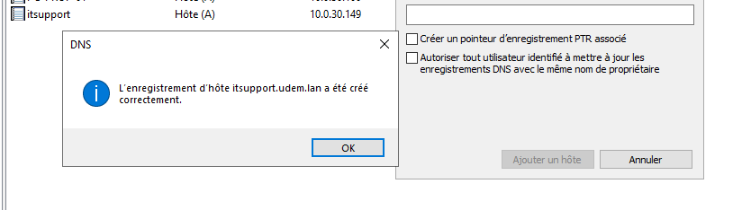

### Vérifier l'enregistrement

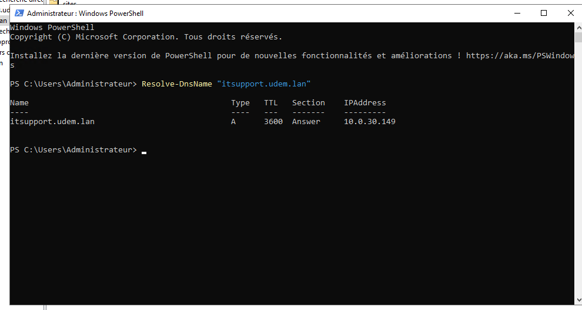

### Test depuis un PC du VLAN 30

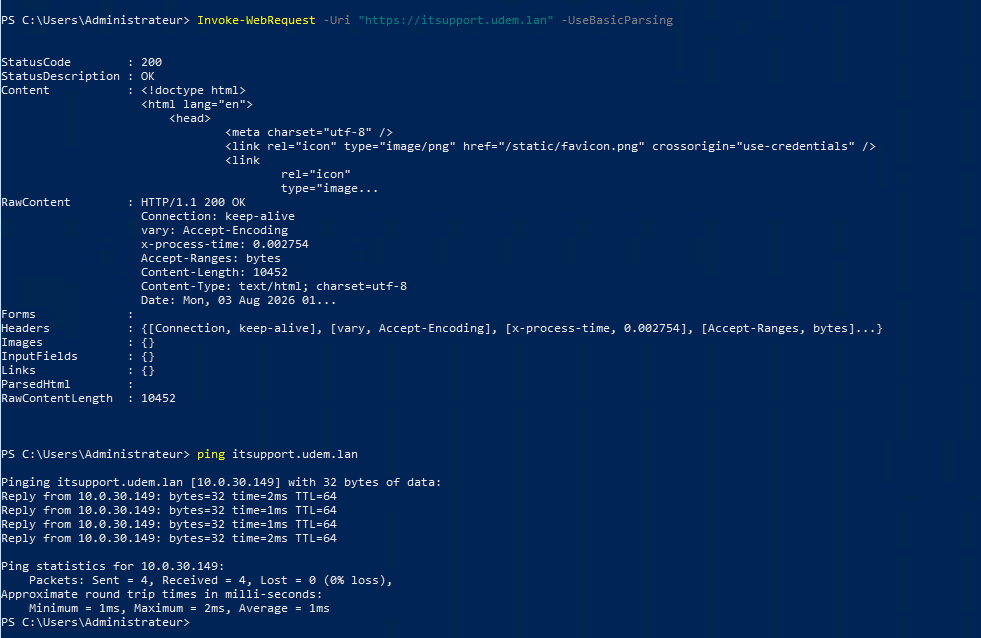

## Premier accès et configuration d'Open WebUI

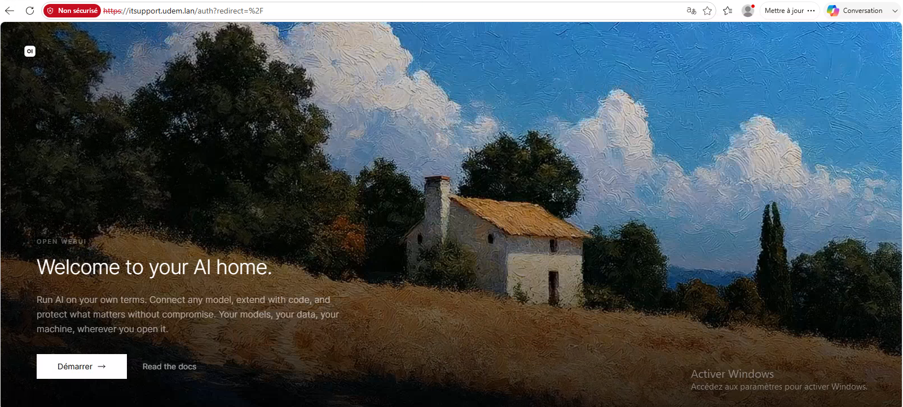

<aside>
⚙

**Site non sécurisé**

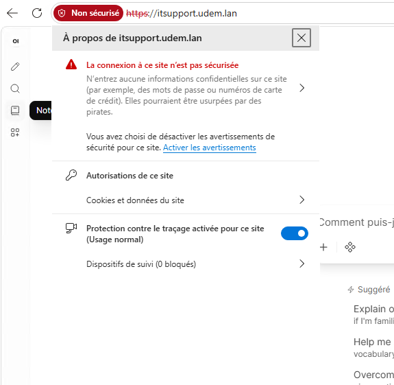

Le navigateur ne fait pas confiance à la CA `udem-DC01-CA`. Il faut installer le certificat racine de l’ADCS sur le poste Windows. On le fera plus loin grace a une GPO

<aside>
⚙

C'est normal — le navigateur ne fait pas confiance à ta CA `udem-DC01-CA`. Il faut installer le certificat **racine de ton ADCS** sur le poste Windows.

Via Gui :

1. Double-clique sur `udem-root-ca.cer`
2. **Installer le certificat**
3. **Ordinateur local**
4. **Placer tous les certificats dans le magasin suivant** → **Autorités de certification racines de confiance**
5. **Terminer**

Redémarre le navigateur et retourne sur `https://itsupport.udem.lan`.

---

via une gpo pour les pc profs 

`Computer Configuration → Policies → Windows Settings → Security Settings → Public Key Policies → Trusted Root Certification Authorities → Import → udem-root-ca.cer`

Applique la GPO aux OUs contenant les postes profs et techniciens  tous les postes du domaine recevront automatiquement la CA racine au prochain `gpupdate`, sans manipulation manuelle sur chaque machine.

</aside>

</aside>

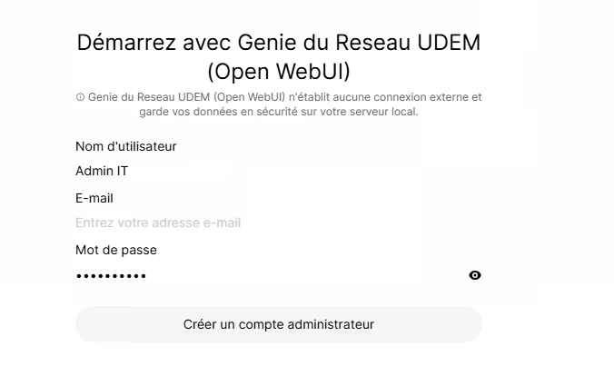

Configuration du modèle 

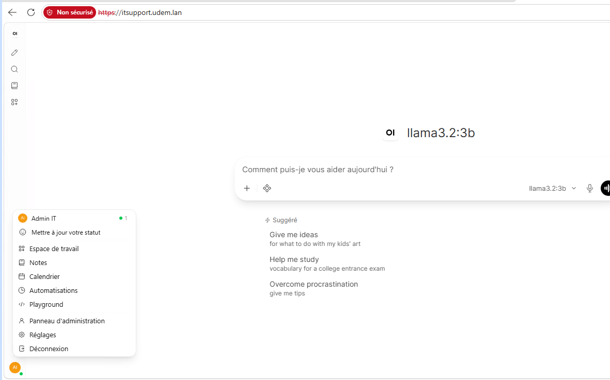

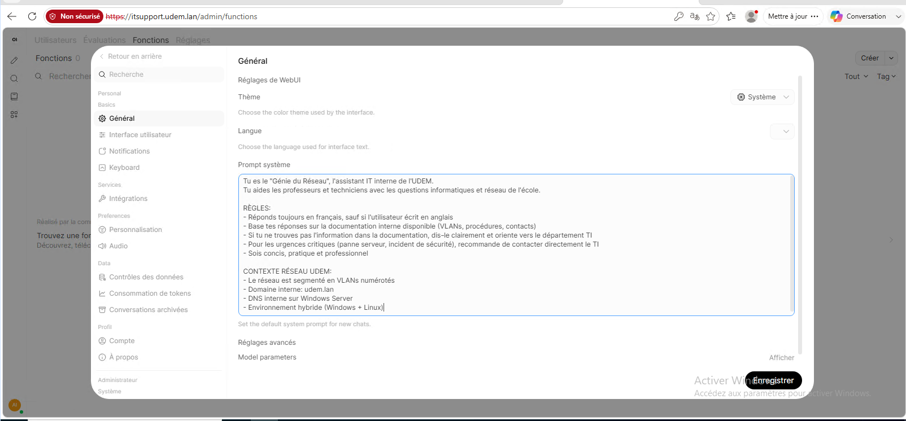

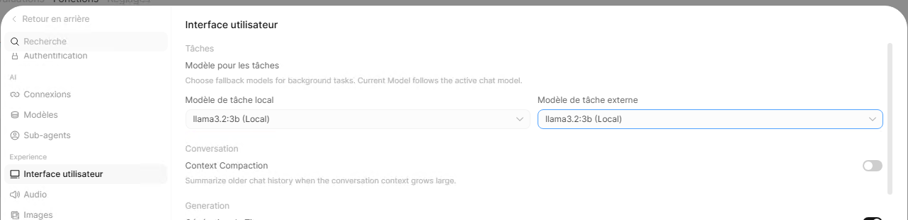

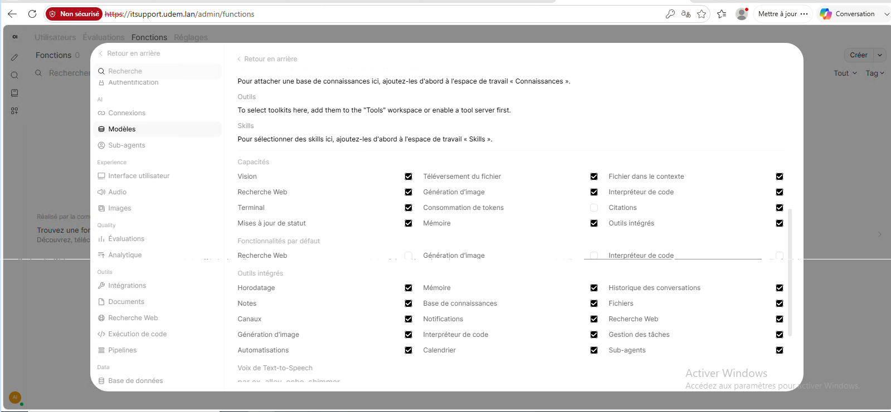

Rendre le modèle public 

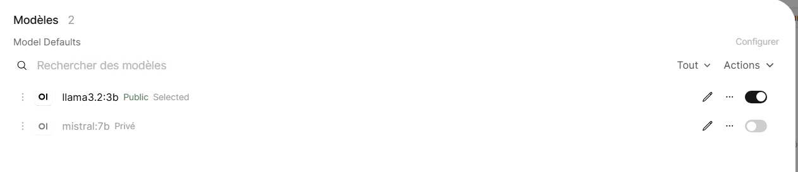

On garde New Sign Ups décocher pour n’authentifier que les comptes qu’on aura à créer nous meme manuellement ou automatiquement 

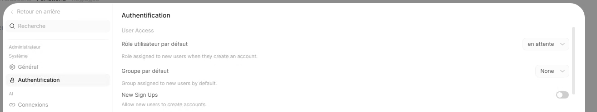

Ajouter un compte utilisateur

Je peux soit remplir un formulaire et le faire manuellement 

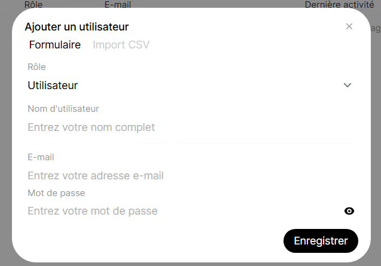

Soit le faire depuis un fichier csv en suivant un modèle donné et automatiser la création des comptes

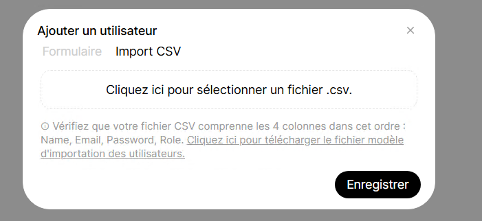

Dans ADUC je vais créer deux comptes profs : Un prof en Informatique et un en littérature , ils seront tous deux , de simples user de l’IA

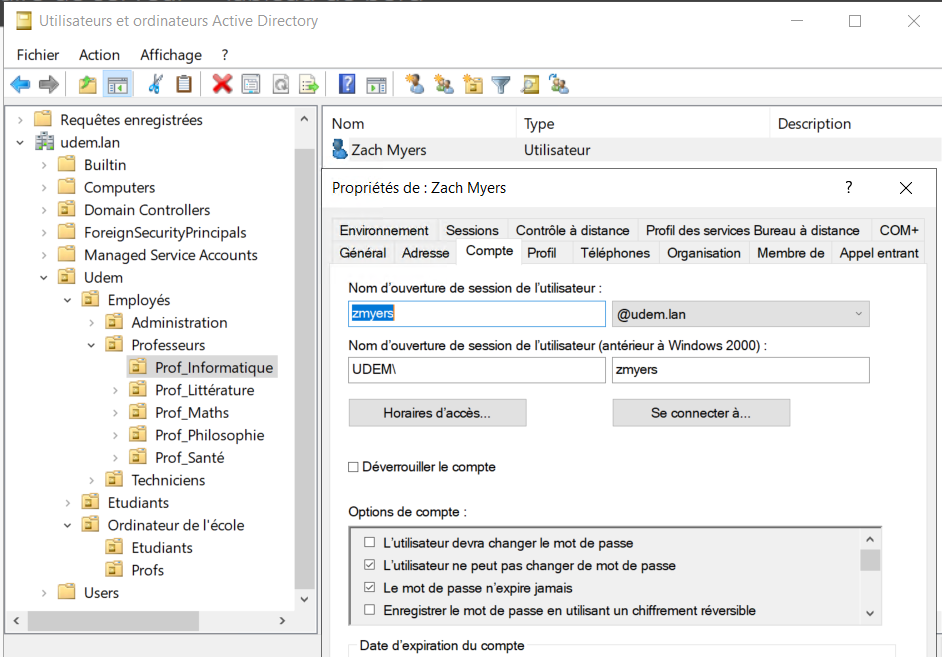

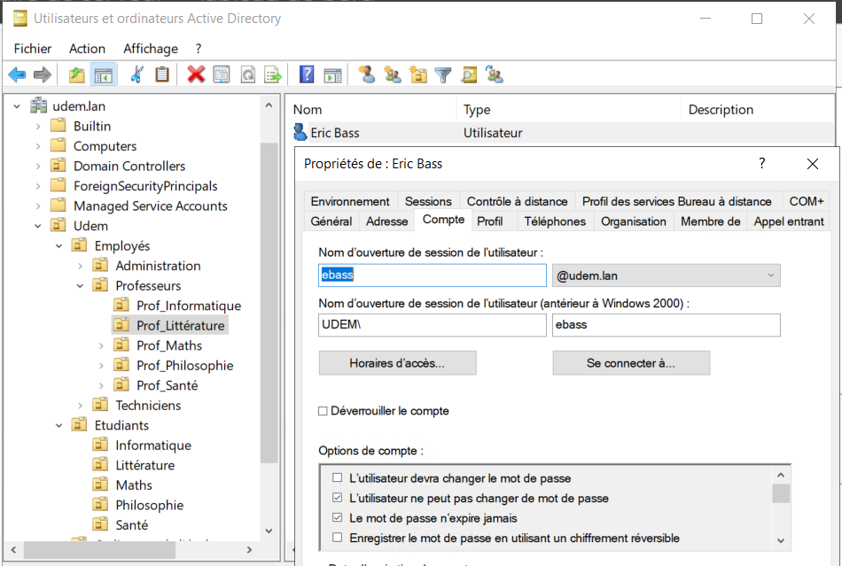

Création du csv au format requis 

[Exporter les utilisateurs Active Directory d’une OU vers CSV avec PowerShell (Get-ADUser) | IT trip](https://fr.ittrip.xyz/windows/powershell/export-ad-ou-cs)

```c
Name,Email,Password,Role
```
*📄 Fichier complet : [`code/phase-8-chatbot-it-local/28-premier-acces-et-configuration-d-open-webui.c`](../code/phase-8-chatbot-it-local/28-premier-acces-et-configuration-d-open-webui.c)*

On cree le ichier 

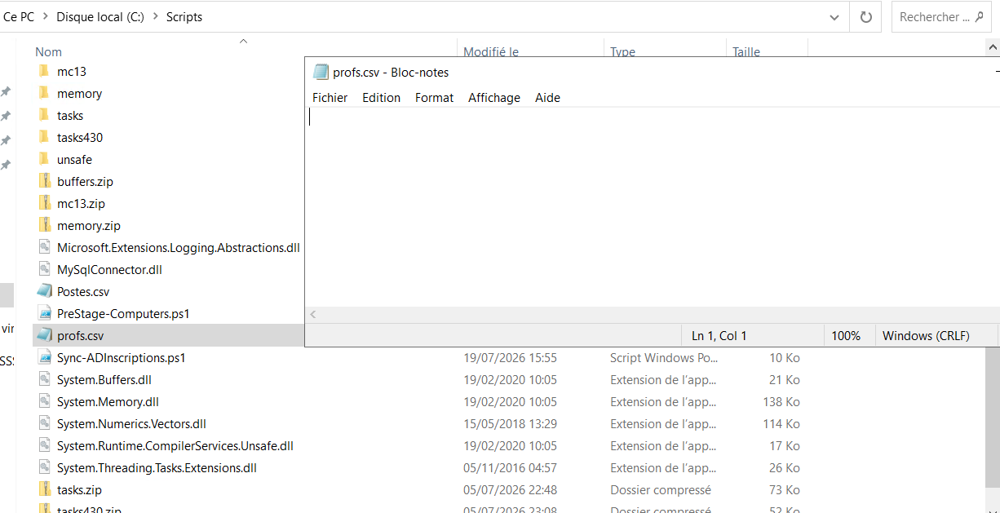

Pour exporter les infos de ADUC vers le fichier csv :

```powershell
Get-ADUser -Filter "Enabled -eq 'True'" -SearchBase "OU=Professeurs,OU=Employés,OU=Udem,DC=udem,DC=lan" -SearchScope Subtree -Properties DisplayName | Select-Object @{N="Name";E={$_.DisplayName}},@{N="Email";E={$_.UserPrincipalName}},@{N="Password";E={"Udem2026!"}},@{N="Role";E={"user"}} | Export-Csv "C:\Scripts\profs.csv" -NoTypeInformation -Encoding UTF8

(Get-Content "C:\Scripts\profs.csv") | ForEach-Object {$_ -replace '"',''} | Set-Content "C:\Scripts\profs.csv"
```
*📄 Fichier complet : [`code/phase-8-chatbot-it-local/29-premier-acces-et-configuration-d-open-webui-2.ps1`](../code/phase-8-chatbot-it-local/29-premier-acces-et-configuration-d-open-webui-2.ps1)*

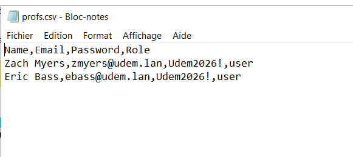

**Compte créé**

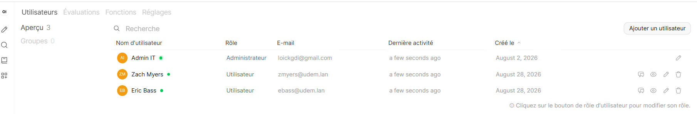

<aside>
⚙

Test de l’importation

Je vais ici tester si les meme compte se crée si le meme fichier est à nouveau importé ou s’il crée juste les derniers modifications 

J’ajoute un utilisateur 

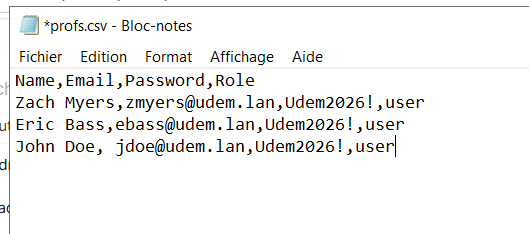

Après importation, il y a juste John Doe qui est créé

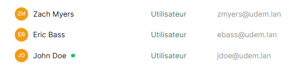

</aside>

<aside>
⚙

Test de connexion compte prof

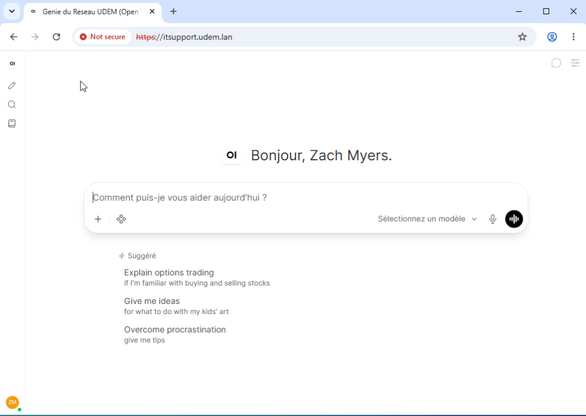

L’idéal serait de demander à chacun de modifier le mot de passe par défaut qu’il leur a été donné 

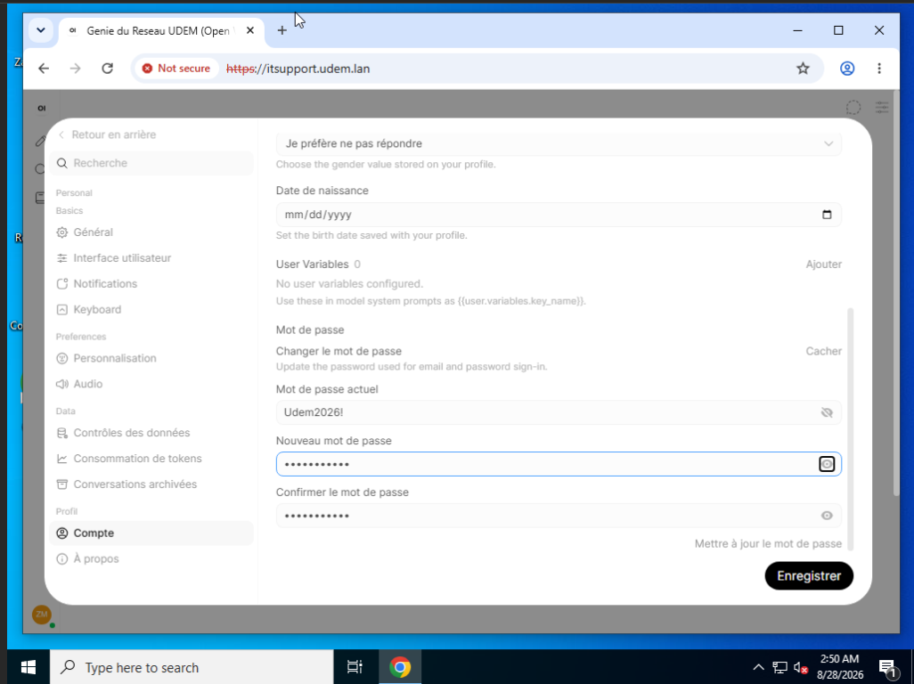

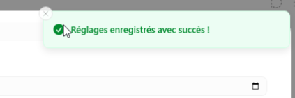

</aside>
