[← Retour au README](../README.md)

# Différents problèmes rencontrées et les solutions apportées

<aside>
🚨

## Connexion au GUI de OpnSense depuis ma machine physique

### Problème

Il a fallu que j’administre mon opnSense donc que j’ai accès a son interface web sans etre physiquement dans le lan du opnsense. Il faut savoir que par défaut opnsense bloque la connexion a son GUI sur le Wan et etant donné que je suis physiquement dans son wan il ne marchait pas à défaut que je fasse `pfctl -d` pour désactiver tout le pare-feu. Ceci regle temporairement mon problème car oui il me permet d’avoir accès au GUI mais plus aucune VM ou CT du lan n’a accès a internet car cette commande disable aussi le NAT qui permettent au VM de sortir sur internet.  

### Solution

La solution la plus safe que j’ai utilisé est le ssh tunneling. Il faut savoir que j’avais déployé Tailscale sur le pve01 donc j’utilise la commande `ssh -L 8080:10.0.0.254:80 [root@](mailto:root@100.70.28.101)<IP tailscale du pve>` puis [`http://localhsost:8080`](http://localhsost:8080) qui me permettait de faire passer tout le directement par le tunnel sécurisé de tailscale jusqu’à l’interface LAN du proxmox et comme ca j’avais accès au GUI comme si j’étais physiquemebt dans le LAN et de maniere sécurisé

</aside>

<aside>
🚨

## Conflit d'adressage sur les Bridges et filtrage VLAN

### Problème

Lors du déploiement initial, une connectivité réseau impossible a été constatée entre le Windows Server (VLAN 20) et la gateway OPNsense, malgré un adressage IP correct. Deux erreurs de configuration majeures bloquaient le trafic au niveau de l'hyperviseur Proxmox : d'une part, l'attribution redondante d'adresses IP directement sur les interfaces `vmbr1` et `vmbr2` créait un conflit de routage interne, l'hyperviseur tentant de s'approprier le trafic du LAN. d'autre part, le bridge Proxmox était configuré de manière restrictive, n'acceptant que le trafic natif (VLAN 1) et rejetant systématiquement les paquets tagués "20" en provenance des machines virtuelles, rendant la gateway invisible (ARP timeout).

### Solution

La résolution a nécessité un nettoyage complet de la couche réseau de Proxmox pour transformer les bridges en "tuyaux" transparents. Premièrement, les adresses IP ont été supprimées des interfaces `vmbr`, laissant à OPNsense l'exclusivité de la gestion du plan d'adressage. Deuxièmement, les interfaces réseau des VMs ont été configurées en mode "Trunk" pour OPNsense (sans tag spécifique) et en mode "Access" pour le Windows Server (Tag 20), tout en désactivant le pare-feu natif de Proxmox sur ces ports. Cette modification a permis au protocole OSPF et aux requêtes ARP de circuler librement, autorisant OPNsense à identifier et router correctement le trafic tagué vers ses interfaces virtuelles respectives.

</aside>

<aside>
🚨

## Perte d'accès à l'interface de gestion GUI de OpnSense

### Problème

Suite à la suppression de l'adresse IP de management sur le bridge `vmbr1` pour corriger les erreurs de routage, l'accès à l'interface graphique (GUI) d'OPNsense via le tunnel SSH a été instantanément rompu. Cette situation a créé un "lock-out" administratif, car le point d'entrée du tunnel (l'IP de l'hyperviseur sur ce segment) n'existait plus, empêchant toute configuration supplémentaire du firewall et des règles de sécurité nécessaires au projet.

### Solution

Creer des route au niveau de proxmox pour qu’il atteigne mes cibles 


</aside>

<aside>
🚨

## GUI Pi-hole unreacheable

### Problème

Après l’installation de mon pihole, j’ai voulu accéder au GUI depuis le Windows Server mais il m’était impossible. Jai essayé de ping et ca passait bien. jai fait un pihole -r pour une reparation et j’ai retry mais toujours rien. J’ai vérifié le pare feu et les port étaient en écoute 

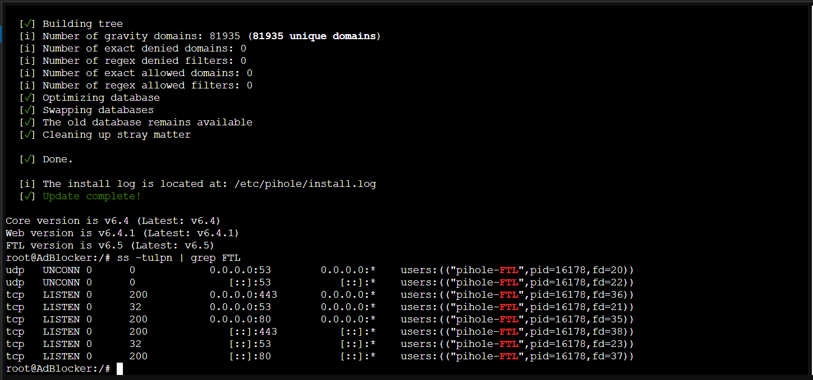

Mais ufw était disable donc jai fait :

`ufw status verbose` , il n’y avait rien. J’ai fait `sudo ufw allow 80/tcp` et `sudo ufw allow 443/tcp` pour ajouter les règles et ensuite `sudo ufw enable` 

### Solution

Creer des routes au niveau de proxmox pour qu’il atteigne mes cibles 

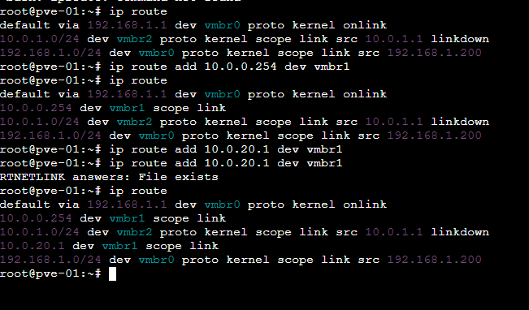

</aside>

<aside>
🚨

## Omission password linux

### Problème

Mot de passe de serveur ubuntu oublié

### Solution

1. Accéder au menu GRUB

- Redémarre ta VM Ubuntu.
- Dès que le logo VMware apparaît, appuie frénétiquement sur la touche **Maj (Shift)** (ou **Échap** si Shift ne fonctionne pas) pour forcer l'affichage du menu GRUB.

2. Modifier les options de boot

- Utilise les flèches pour sélectionner la ligne de ton noyau habituel (souvent la première).
- Appuie sur la touche **`e`** pour éditer les commandes de démarrage.
- Cherche la ligne qui commence par `linux /boot/vmlinuz...`.
- Va à la fin de cette ligne (elle finit souvent par `ro quiet splash`).
- Remplace `ro quiet splash`  ou `ro`par :
    
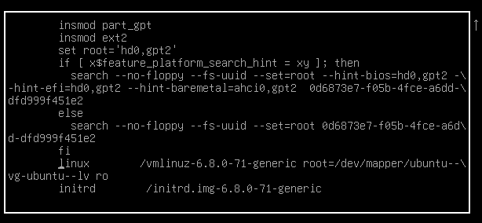
    
    `rw init=/bin/bash`
    
- Appuie sur **F10** ou **Ctrl+X** pour démarrer avec ces paramètres.

3. Réinitialiser le mot de passe

Ton système va démarrer très vite et t'afficher une ligne de commande qui ressemble à `root@(none):/#`. Tu es maintenant super-utilisateur sans mot de passe.

- **Change le mot de passe** (remplace `ton_utilisateur` par ton nom d'utilisateur, ou tape `root`) :
    
    `passwd ton_utilisateur`
    
- Tape ton nouveau mot de passe deux fois (les caractères ne s'affichent pas, c'est normal).
- **Synchronise et redémarre** :
    
    `syncreboot -f`
    

</aside>

<aside>
🚨

## Résolution de la Connectivité DNS Inter-VLAN

### Problème

Les clients situés sur les segments réseau isolés (**VLAN 10/OPT2** et **VLAN 30/OPT3**) parvenaient à pinger l'adresse IP du serveur DNS (**10.0.20.2**) mais ne recevaient aucune réponse aux requêtes de résolution de noms (DNS Timeout). La navigation web était donc impossible malgré une connectivité IP fonctionnelle.

### Diagnostic des Points de Blocage

Le problème était multidimensionnel, touchant trois couches distinctes de l'infrastructure :

- **Couche Réseau (OPNsense) :** Blocage des flux UDP/53 entre les interfaces virtuelles.
- **Couche Application (Pi-hole v6) :** Restriction de sécurité native n'autorisant que les requêtes provenant du même sous-réseau.
- **Couche Système (Ubuntu/UFW) :** Pare-feu local du conteneur LXC rejetant les paquets entrants non déclarés.

### Solutions

#### Optimisation du Pare-feu OPNsense (Principe du Moindre Privilège)

Au lieu d'ouvrir totalement les flux, nous avons restreint l'accès au strict nécessaire :

- **Action :** Création de règles de type `Pass` sur les interfaces sources (**OPT2/OPT3**).
- **Configuration :** Autorisation du protocole `UDP/TCP` sur le port `53` avec pour destination unique l'IP fixe du Pi-hole (`10.0.20.2`).
    
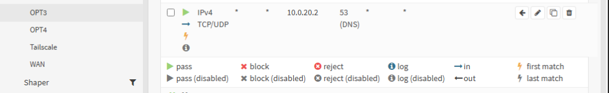
    
- **Sécurité accrue :** Désactivation du *DNS Rebind Check* dans les paramètres globaux d'OPNsense pour permettre l'utilisation d'un résolveur privé sans interférence du mécanisme anti-spoofing du firewall.

#### Configuration du Service Pi-hole v6 (Souveraineté des Données)

Pour permettre au service de répondre aux clients distants (VLANs différents) sans compromettre la sécurité de l'hôte :

- **Modification du mode d'écoute :** Passage du paramètre `listeningMode` de `LOCAL` à `ALL` dans le fichier `pihole.toml`.
- **Suppression des dépendances d'interface :** Configuration de `interface = ""` pour permettre l'auto-détection des flux sur le bridge Proxmox.
- **Hardening DNS :** Configuration de serveurs DNS récursifs de confiance (Upstreams) et activation de la protection contre les requêtes non sollicitées.

#### Sécurisation du Système Hôte (UFW Hardening)

Plutôt que de laisser le pare-feu du conteneur désactivé, nous avons défini des règles d'entrée granulaires :

- **Commande appliquée :** `ufw allow from 10.0.0.0/8 to any port 53 proto udp`. `ufw allow from 10.0.0.0/8 to any port 53 proto tcp`

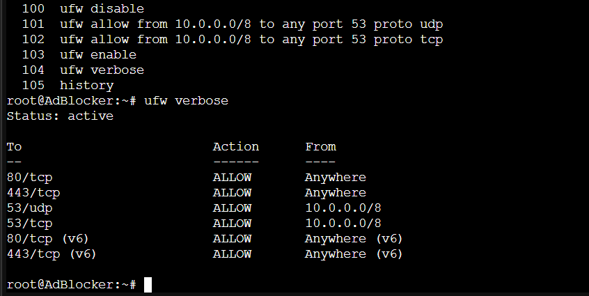

- **Justification :** Cette règle autorise uniquement les réseaux internes de l'école (10.x.x.x) à interroger le service DNS, bloquant toute tentative d'accès non autorisée provenant d'autres sources potentielles.

### Résultat Final

- **Test de validation :** La commande `Resolve-DnsName google.com -Server 10.0.20.2` depuis un client Windows retourne désormais une réponse valide en moins de 30ms.
- **Bilan :** L'infrastructure respecte désormais les standards de sécurité **Zero Trust** : chaque flux est identifié, autorisé spécifiquement, et le serveur DNS est protégé à la fois par le pare-feu périmétrique et son propre pare-feu local.
</aside>

<aside>
🚨

## Échec de l'application des politiques de filtrage DNS

### **Problème :**

Après l'ajout de listes de blocage tierces (Adlists) dans la configuration, le serveur DNS ne bloquait aucun domaine. Les requêtes vers des sites publicitaires ou malveillants étaient toujours autorisées (statut *OK / Forwarded*) dans les journaux d'activité. Le système disposait des sources de filtrage, mais n'avait pas encore intégré les signatures de blocage dans son moteur de décision en temps réel, rendant la protection inopérante.

---

### **Solution :**

La résolution a nécessité le déclenchement manuel du processus de compilation de la base de données de sécurité via la commande : `pihole -g`.

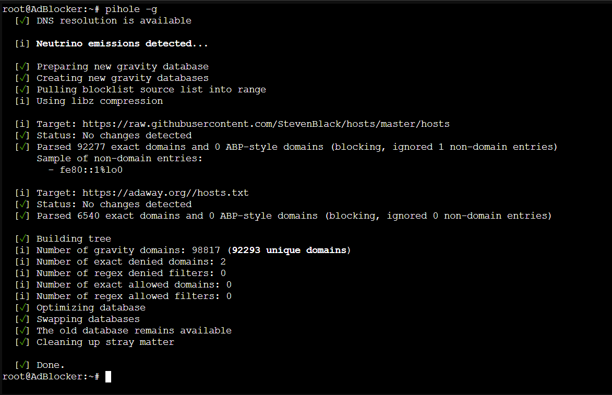

**Explication technique de Gravity (`pihole -g`) :**

La commande **Gravity** est le cœur du mécanisme de durcissement (Hardening) du service. Son exécution est indispensable pour transformer une configuration théorique en une défense active :

- **Récupération et Convergence :** Elle interroge les serveurs distants pour télécharger les fichiers de menaces les plus récents (listes de domaines).
- **Nettoyage et Optimisation :** Elle analyse, nettoie et déduplique les millions d'entrées pour construire une base de données locale ultra-optimisée (`gravity.db`). Cela permet au moteur de recherche de filtrer les requêtes en quelques microsecondes sans ralentir la navigation.
- **Activation du filtrage :** C'est cette commande qui "arme" le serveur. Elle injecte les domaines interdits dans la mémoire vive du service. Sans cette synchronisation, le serveur reste une "coquille vide" qui connaît les listes de noms mais ignore le contenu détaillé des menaces à bloquer.
- **Intégrité de la défense :** Dans un cadre professionnel, l'automatisation de `pihole -g` assure que le système de filtrage n'est jamais obsolète face aux nouveaux vecteurs d'attaque ou de tracking.
</aside>

<aside>
👉🏼

## Accès SSH aux conteneurs LXC via Tailscale

Problème 1

Je voulais pouvoir accéder à mes conteneurs Linux  (VLAN20) depuis mon laptop, sans exposer de ports SSH sur le WAN de mon firewall. Mon PC étant hors du LAN (et parfois hors de chez moi), je ne voulais pas créer de règles NAT ou firewall risquées côté WAN.

Solution 1

J’ai utilisé **Tailscale + un tunnel SSH** via mon serveur Proxmox (PVE) qui sert de point d’entrée sécurisé. `ssh -L 2222:10.0.20.3:22 root@<Ip tailscale>` Puis connexion : `ssh root@localhost -p 2222`

---

Problème 2

Le tunnel était bien établi, mais impossible de se connecter à la machine cible. Le service SSH était tout simplement inactif dans le conteneur LXC.

Solution 2

```
apt install openssh-server
systemctl enable ssh
systemctl start ssh
```
*📄 Fichier complet : [`code/troubleshooting/01-acces-ssh-aux-conteneurs-lxc-via-tailscale.txt`](../code/troubleshooting/01-acces-ssh-aux-conteneurs-lxc-via-tailscale.txt)*

---

Problème 3

Même après installation, le service SSH se lançait puis s’arrêtait immédiatement (`inactive (dead)`).

Après investigation, l’erreur était liée à l’environnement LXC :

`Missing privilege separation directory: /run/sshd`

Solution 3

```
mkdir-p /run/sshd
chmod755 /run/sshd
```
*📄 Fichier complet : [`code/troubleshooting/02-acces-ssh-aux-conteneurs-lxc-via-tailscale-2.txt`](../code/troubleshooting/02-acces-ssh-aux-conteneurs-lxc-via-tailscale-2.txt)*

Puis relancer SSH : `systemctl restart ssh`

---

Problème 4

Le problème revenait après chaque redémarrage du conteneur, car le dossier `/run/sshd` est temporaire.

Solution 4

Rendre la correction persistante : `nano /etc/tmpfiles.d/sshd.conf`

Contenu : `d /run/sshd 0755 root root`

Puis appliquer : `systemd-tmpfiles--create`

---

Problème 5

Une fois SSH fonctionnel, la connexion échouait avec :

`Permission denied (publickey,password)`

Solution 5

Le problème venait de la configuration SSH qui bloque par défaut certains accès (notamment root).

Modification de : `nano /etc/ssh/sshd_config`

Paramètres ajustés :

```
PermitRootLogin yes
PasswordAuthentication yes
```
*📄 Fichier complet : [`code/troubleshooting/03-acces-ssh-aux-conteneurs-lxc-via-tailscale-3.txt`](../code/troubleshooting/03-acces-ssh-aux-conteneurs-lxc-via-tailscale-3.txt)*

Puis :`systemctl restart ssh`

---

Problème 6 

Connexion en root avec mot de passe = mauvaise pratique de sécurité.

Solution 6 (A prévoir)

- Créer un utilisateur
- Désactiver root
- Désactiver mot de passe
</aside>

<aside>
🚨

## Echec de connexion a la base de données pendant l’inscription en ligne

### Problème

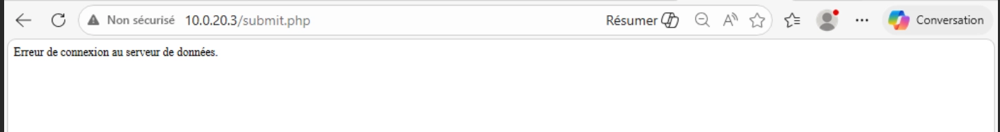

### Solution

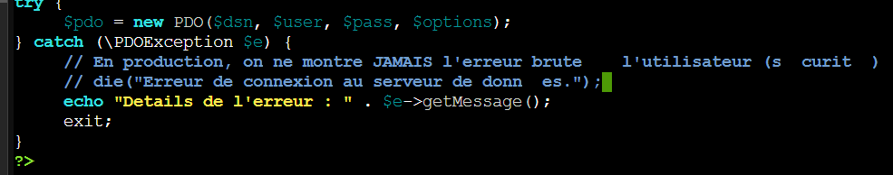

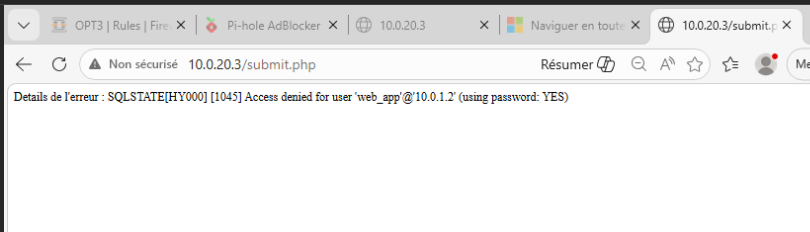

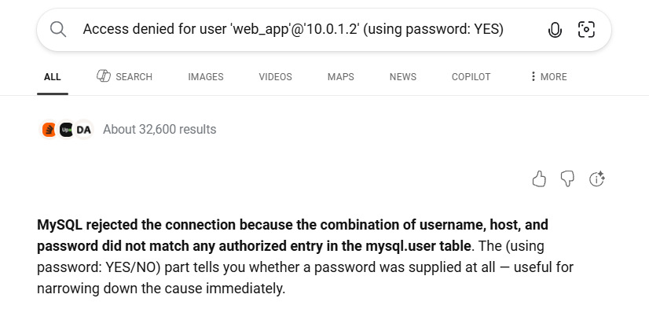

Ce que ça veut dire : MariaDB connaît l'utilisateur, mais le mot de passe envoyé par le PHP ne correspond pas à ce qui est stocké dans la base.

```sql
GRANT ALL PRIVILEGES ON school_db.* TO 'web_app'@'10.0.1.2' IDENTIFIED BY 'Password01$';

FLUSH PRIVILEGES;
```
*📄 Fichier complet : [`code/troubleshooting/04-solution.sql`](../code/troubleshooting/04-solution.sql)*

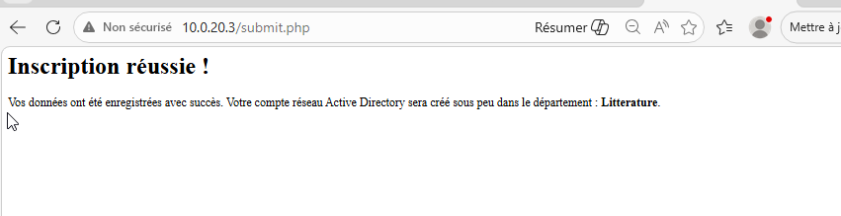

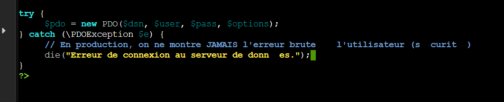

</aside>

<aside>
⚙

## Rapport de Débogage — Intégration MySqlConnector sous PowerShell 5.1

---

### Contexte général

Le script PowerShell `Sync-ADInscriptions.ps1` a pour rôle d'interroger une base **MariaDB**,
de générer des matricules étudiants, de créer les comptes dans **Active Directory** et de
préparer les dossiers personnels sur un serveur de fichiers Linux via SMB.

Le connecteur utilisé est **MySqlConnector** (bibliothèque .NET tierce), chargée manuellement
via `[System.Reflection.Assembly]::LoadFrom()` dans PowerShell.

---

### Problème 1 — Exception lors de l'initialisation de MySqlConnectorLoggingConfiguration

**Erreur :**

```
Une exception a été levée par l'initialiseur de type pour
'MySqlConnector.Logging.MySqlConnectorLoggingConfiguration'
```
*📄 Fichier complet : [`code/troubleshooting/05-probleme-1-exception-lors-de-l-initialisation.txt`](../code/troubleshooting/05-probleme-1-exception-lors-de-l-initialisation.txt)*

**Pourquoi ça arrive :**

Seule la DLL principale `MySqlConnector.dll` était présente dans `C:\Scripts`.
Or, une bibliothèque .NET ne fonctionne jamais seule — elle embarque des dépendances
(d'autres `.dll`) qu'elle doit pouvoir charger au démarrage. Ici, `Microsoft.Extensions.Logging.Abstractions.dll`
était absente, ce qui provoque un crash immédiat dès que .NET tente d'initialiser
la classe de logging interne du connecteur.

**Solution :**

Récupérer toutes les DLL associées via NuGet et les charger dans le même répertoire.

---

### Problème 2 — NuGet.org non enregistré comme source de packages

**Erreur :**

```
Install-Package : Aucune correspondance trouvée pour MySqlConnector
```
*📄 Fichier complet : [`code/troubleshooting/06-probleme-2-nuget-org-non-enregistre-comme-sou.txt`](../code/troubleshooting/06-probleme-2-nuget-org-non-enregistre-comme-sou.txt)*

**Pourquoi ça arrive :**

PowerShell gère les packages via des *sources* déclarées. Par défaut, seule **PSGallery**
(la galerie officielle PowerShell) est enregistrée. NuGet.org, qui héberge les bibliothèques
.NET, n'est pas déclaré automatiquement. Le gestionnaire cherche donc MySqlConnector
dans PSGallery, où il n'existe pas.

**Solution :**

Enregistrer manuellement la source NuGet.org :

```powershell
Register-PackageSource -Name "NuGetOrg" -Location "https://www.nuget.org/api/v2" -ProviderName NuGet -Trusted -Force
```
*📄 Fichier complet : [`code/troubleshooting/07-probleme-2-nuget-org-non-enregistre-comme-sou-2.ps1`](../code/troubleshooting/07-probleme-2-nuget-org-non-enregistre-comme-sou-2.ps1)*

---

### Problème 3 — PowerShell 5.1 incompatible avec l'API NuGet v3

**Erreur :**

```
Register-PackageSource : Source Location 'https://api.nuget.org/v3/index.json' is not valid.
```
*📄 Fichier complet : [`code/troubleshooting/08-probleme-3-powershell-5-1-incompatible-avec-l.txt`](../code/troubleshooting/08-probleme-3-powershell-5-1-incompatible-avec-l.txt)*

**Pourquoi ça arrive :**

NuGet expose deux versions de son API : v2 (ancienne, format OData/XML) et v3 (moderne, format JSON).
Le provider NuGet intégré à PowerShell 5.1 a été développé avant l'existence de l'API v3 et
ne sait pas l'interpréter. Toute tentative d'enregistrement avec l'URL v3 est donc rejetée.

**Solution :**

Utiliser l'URL de l'API v2 :

```
https://www.nuget.org/api/v2
```
*📄 Fichier complet : [`code/troubleshooting/09-probleme-3-powershell-5-1-incompatible-avec-l-2.txt`](../code/troubleshooting/09-probleme-3-powershell-5-1-incompatible-avec-l-2.txt)*

---

### Problème 4 — Fichiers DLL bloqués par Windows (Mark of the Web — HRESULT 0x80131515)

**Erreur :**

```
Impossible de charger le fichier ou l'assembly 'MySqlConnector.dll'
L'opération n'est pas prise en charge. (Exception de HRESULT : 0x80131515)
```
*📄 Fichier complet : [`code/troubleshooting/10-probleme-4-fichiers-dll-bloques-par-windows-m.txt`](../code/troubleshooting/10-probleme-4-fichiers-dll-bloques-par-windows-m.txt)*

**Pourquoi ça arrive :**

Windows applique automatiquement un attribut de sécurité invisible appelé
**"Mark of the Web" (MOTW)** sur tout fichier téléchargé depuis Internet. Cet attribut
est stocké dans un flux NTFS alternatif (ADS — Alternate Data Stream). Quand .NET tente
de charger une DLL portant ce marqueur, le runtime refuse par mesure de sécurité
(politique de zone Internet). C'est indépendant du contenu du fichier.

**Solution :**

Supprimer le marqueur MOTW via `Unblock-File` (ou manuellement via Propriétés → Débloquer) :

```powershell
Get-ChildItem "C:\Scripts\*.dll" | Unblock-File
```
*📄 Fichier complet : [`code/troubleshooting/11-probleme-4-fichiers-dll-bloques-par-windows-m-2.ps1`](../code/troubleshooting/11-probleme-4-fichiers-dll-bloques-par-windows-m-2.ps1)*

---

### Problème 5 — MySqlConnector version récente abandonne le support .NET Framework

**Erreur :**

Aucun dossier `net461` dans le package téléchargé — uniquement `net6.0`, `net8.0`, etc.

**Pourquoi ça arrive :**

À partir de la version 2.x, MySqlConnector a abandonné le support de .NET Framework
au profit de .NET 5/6/7/8 uniquement. PowerShell 5.1 tourne sur .NET Framework 4.x
et ne peut pas charger des assemblies compilés pour .NET 6+. Les dossiers `net6.0`
dans le package NuGet sont donc incompatibles avec l'environnement d'exécution.

**Solution :**

Utiliser **MySqlConnector version 1.3.x**, dernière version à avoir inclus
un build `net461` (compatible .NET Framework) :

```powershell
Invoke-WebRequest "https://www.nuget.org/api/v2/package/MySqlConnector/1.3.0" -OutFile "C:\Scripts\mc13.zip"
```
*📄 Fichier complet : [`code/troubleshooting/12-probleme-5-mysqlconnector-version-recente-aba.ps1`](../code/troubleshooting/12-probleme-5-mysqlconnector-version-recente-aba.ps1)*

---

### Problème 6 — Script chargeant une seule DLL au lieu de toutes

**Symptôme :**

Même avec les bonnes DLL présentes, seule `MySqlConnector.dll` était chargée.

**Pourquoi ça arrive :**

Le script original utilisait une variable `$DllPath` pointant sur un seul fichier.
Toutes les DLL de dépendances copiées dans le dossier étaient ignorées — .NET les
cherche automatiquement dans le GAC (Global Assembly Cache) ou dans le répertoire
de l'application, mais pas dans un dossier arbitraire comme `C:\Scripts\` sans
instruction explicite.

**Solution :**

Charger toutes les DLL présentes dans le dossier en boucle, et installer un
**handler de résolution d'assembly** pour intercepter les demandes de version à la volée :

```powershell
$onResolve = [System.ResolveEventHandler]{
    param($s, $e)
    $name = ([System.Reflection.AssemblyName]$e.Name).Name
    $path = "C:\Scripts\$name.dll"
    if (Test-Path $path) { return [System.Reflection.Assembly]::LoadFile($path) }
    return $null
}
[AppDomain]::CurrentDomain.add_AssemblyResolve($onResolve)

Get-ChildItem "C:\Scripts\*.dll" | ForEach-Object {
    [void][System.Reflection.Assembly]::LoadFile($_.FullName)
}
```
*📄 Fichier complet : [`code/troubleshooting/13-probleme-6-script-chargeant-une-seule-dll-au-.ps1`](../code/troubleshooting/13-probleme-6-script-chargeant-une-seule-dll-au-.ps1)*

---

## Problème 7 — Mauvaise version de System.Threading.Tasks.Extensions (4.2.4 vs 4.1.0)

**Erreur :**

```
Impossible de charger l'assembly 'System.Threading.Tasks.Extensions,
Version=4.1.0.0, PublicKeyToken=cc7b13ffcd2ddd51'
```
*📄 Fichier complet : [`code/troubleshooting/14-probleme-7-mauvaise-version-de-system-threadi.txt`](../code/troubleshooting/14-probleme-7-mauvaise-version-de-system-threadi.txt)*

**Pourquoi ça arrive :**

.NET applique par défaut une politique de **strict version matching** : si une bibliothèque
demande exactement la version `4.1.0.0`, le runtime refuse de charger la `4.2.4.0`
même si elle est rétrocompatible. Sans fichier de configuration `app.config` contenant
un `<bindingRedirect>`, il n'y a pas de tolérance de version. La DLL téléchargée
(version récente du package) était en `4.2.4.0`.

**Solution :**

Deux axes complémentaires :

1. Installer le handler `AssemblyResolve` (voir Problème 6) qui contourne la vérification de version.
2. Utiliser la version exacte `4.1.0.0` du package portable (trouvée dans
`tasks430\lib\portable-net45+win8+wp8+wpa81\`) :

```powershell
Invoke-WebRequest "https://www.nuget.org/api/v2/package/System.Threading.Tasks.Extensions/4.3.0" -OutFile "C:\Scripts\tasks430.zip"
```
*📄 Fichier complet : [`code/troubleshooting/15-probleme-7-mauvaise-version-de-system-threadi-2.ps1`](../code/troubleshooting/15-probleme-7-mauvaise-version-de-system-threadi-2.ps1)*

---

## Problème 8 — DLL verrouillée par le processus PowerShell actif

**Erreur :**

```
Copy-Item : Le processus ne peut pas accéder au fichier
'System.Threading.Tasks.Extensions.dll', car il est en cours d'utilisation.
```
*📄 Fichier complet : [`code/troubleshooting/16-probleme-8-dll-verrouillee-par-le-processus-p.txt`](../code/troubleshooting/16-probleme-8-dll-verrouillee-par-le-processus-p.txt)*

**Pourquoi ça arrive :**

Dès qu'une DLL .NET est chargée dans la mémoire d'un processus via `LoadFile()` ou
`LoadFrom()`, Windows pose un **verrou exclusif** dessus au niveau du système de fichiers
NTFS. Tant que le processus PowerShell reste ouvert, aucun autre processus (ni le même)
ne peut écrire ou remplacer ce fichier. C'est un comportement normal du CLR .NET.

**Solution :**

Fermer complètement la session PowerShell pour libérer le verrou,
puis rouvrir une nouvelle session et copier la DLL avant tout chargement.

---

## Problème 9 — Dépendances System.Memory, System.Buffers, System.Runtime.CompilerServices.Unsafe manquantes

**Erreur :**

```
Impossible de charger l'assembly 'System.Memory, Version=4.0.1.0'
```
*📄 Fichier complet : [`code/troubleshooting/17-probleme-9-dependances-system-memory-system-b.txt`](../code/troubleshooting/17-probleme-9-dependances-system-memory-system-b.txt)*

**Pourquoi ça arrive :**

MySqlConnector 1.3.x utilise des types haute performance (`Span<T>`, `Memory<T>`,
`ArrayPool<T>`) qui ne sont pas présents dans .NET Framework 4.x natif. Ces types
ont été backportés via des packages NuGet séparés (`System.Memory`, `System.Buffers`,
`System.Runtime.CompilerServices.Unsafe`). Ils ne font pas partie du framework de base
et doivent être fournis explicitement.

**Solution :**

Télécharger et copier les trois packages :

```powershell
Invoke-WebRequest "https://www.nuget.org/api/v2/package/System.Memory/4.5.4"           -OutFile "C:\Scripts\memory.zip"
Invoke-WebRequest "https://www.nuget.org/api/v2/package/System.Buffers/4.5.1"          -OutFile "C:\Scripts\buffers.zip"
Invoke-WebRequest "https://www.nuget.org/api/v2/package/System.Runtime.CompilerServices.Unsafe/4.5.3" -OutFile "C:\Scripts\unsafe.zip"
```
*📄 Fichier complet : [`code/troubleshooting/18-probleme-9-dependances-system-memory-system-b-2.ps1`](../code/troubleshooting/18-probleme-9-dependances-system-memory-system-b-2.ps1)*

---

## Problème 10 — Option de connexion invalide dans la connection string

**Erreur :**

```
Option 'useextendedproperties' not supported.
```
*📄 Fichier complet : [`code/troubleshooting/19-probleme-10-option-de-connexion-invalide-dans.txt`](../code/troubleshooting/19-probleme-10-option-de-connexion-invalide-dans.txt)*

**Pourquoi ça arrive :**

La chaîne de connexion contenait `UseExtendedProperties=false`, une option propre
à l'ancien connecteur **MySQL Connector/NET (MySql.Data)** d'Oracle. MySqlConnector
est une implémentation indépendante qui ne reconnaît pas cette option et lève une exception
immédiate à l'ouverture de la connexion.

**Solution :**

Retirer cette option de la chaîne de connexion :

```powershell
(Get-Content "C:\Scripts\Sync-ADInscriptions.ps1") -replace ';UseExtendedProperties=false', '' |
Set-Content "C:\Scripts\Sync-ADInscriptions.ps1"
```
*📄 Fichier complet : [`code/troubleshooting/20-probleme-10-option-de-connexion-invalide-dans-2.ps1`](../code/troubleshooting/20-probleme-10-option-de-connexion-invalide-dans-2.ps1)*

---

## Récapitulatif — État final du dossier C:\Scripts

| Fichier | Rôle | Statut |
| --- | --- | --- |
| `MySqlConnector.dll` | Connecteur principal MariaDB | ✅ |
| `Microsoft.Extensions.Logging.Abstractions.dll` | Logging interne MySqlConnector | ✅ |
| `System.Threading.Tasks.Extensions.dll` (v4.1.0.0) | Async/await sur .NET Framework | ✅ |
| `System.Memory.dll` | Types Span/Memory backportés | ✅ |
| `System.Buffers.dll` | Gestion de buffers haute perf | ✅ |
| `System.Runtime.CompilerServices.Unsafe.dll` | Opérations mémoire non sécurisées | ✅ |

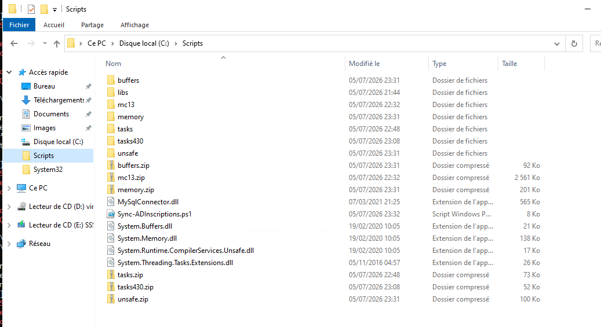

---

## Leçon principale à retenir

> Charger une DLL .NET tierce manuellement dans PowerShell 5.1 revient à
reproduire manuellement ce que fait normalement un gestionnaire de dépendances (NuGet + MSBuild). Chaque bibliothèque embarque un graphe de dépendances transitives que .NET s'attend à trouver dans le GAC ou dans le répertoire de l'application. Sur un runtime vieillissant (.NET Framework), les backports de packages modernes ajoutent des couches de compatibilité supplémentaires qui doivent toutes être résolues manuellement.
> 

---

</aside>

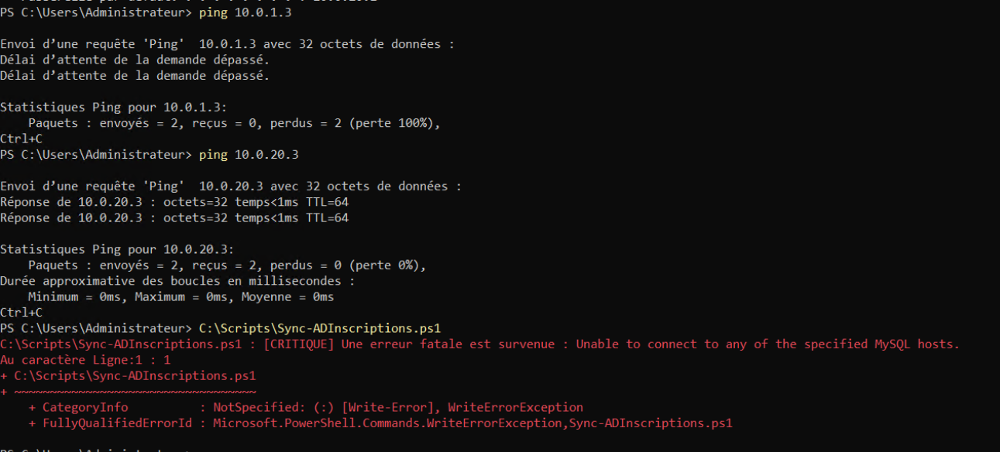

<aside>
⚙

SUITE TROOBLESHOOTING PHASE 5

## Problème 11 — Dépendance transitive manquante (System.Numerics.Vectors)

**Erreur :**

```
System.IO.FileNotFoundException
Impossible de charger le fichier ou l'assembly 'System.Numerics.Vectors,
Version=4.1.4.0, Culture=neutral, PublicKeyToken=b03f5f7f11d50a3a' ou une
de ses dépendances. Le fichier spécifié est introuvable.
```
*📄 Fichier complet : [`code/troubleshooting/21-probleme-11-dependance-transitive-manquante-s.txt`](../code/troubleshooting/21-probleme-11-dependance-transitive-manquante-s.txt)*

**Pourquoi ça arrive :**`System.Memory` dépend elle-même de `System.Numerics.Vectors`, une DLL supplémentaire jamais copiée dans `C:\Scripts`. Le handler `AssemblyResolve` (Problème 6) a bien intercepté la demande, mais n'a rien trouvé au chemin attendu.

**Solution :**
Télécharger le package NuGet et copier la version `net46` :

```powershell
Invoke-WebRequest "https://www.nuget.org/api/v2/package/System.Numerics.Vectors/4.5.0" -OutFile "C:\Scripts\numerics.zip"
Expand-Archive "C:\Scripts\numerics.zip" -DestinationPath "C:\Scripts\numerics_extract" -Force
Copy-Item "C:\Scripts\numerics_extract\lib\net46\System.Numerics.Vectors.dll" -Destination "C:\Scripts\" -Force
Unblock-File "C:\Scripts\System.Numerics.Vectors.dll"
```
*📄 Fichier complet : [`code/troubleshooting/22-probleme-11-dependance-transitive-manquante-s-2.ps1`](../code/troubleshooting/22-probleme-11-dependance-transitive-manquante-s-2.ps1)*

---

## Problème 12 — Erreur "Null" masquant la vraie cause

**Erreur :**

```
Impossible d'appeler une méthode dans une expression Null.
```
*📄 Fichier complet : [`code/troubleshooting/23-probleme-12-erreur-null-masquant-la-vraie-cau.txt`](../code/troubleshooting/23-probleme-12-erreur-null-masquant-la-vraie-cau.txt)*

**Pourquoi ça arrive :**`New-Object MySqlConnector.MySqlConnection(...)` était placé **avant** le bloc `try`. Une erreur non-terminante sur cette ligne laissait `$Connection` à `$null` sans jamais afficher la cause réelle, provoquant un plantage plus loin sur `$Connection.Open()`.

**Solution :**
Déplacer la création de l'objet **dans** le `try` avec `-ErrorAction Stop`, et enrichir le `catch` pour dérouler toute la chaîne d'`InnerException` :

```powershell
try {
    $Connection = New-Object MySqlConnector.MySqlConnection($ConnectionString) -ErrorAction Stop
    $Connection.Open()
} catch {
    Write-Host $_.Exception.Message
    $inner = $_.Exception.InnerException
    while ($inner) {
        Write-Host $inner.Message
        $inner = $inner.InnerException
    }
}
```
*📄 Fichier complet : [`code/troubleshooting/24-probleme-12-erreur-null-masquant-la-vraie-cau-2.ps1`](../code/troubleshooting/24-probleme-12-erreur-null-masquant-la-vraie-cau-2.ps1)*

Ce changement a permis de révéler le Problème 11 ci-dessus, qui était jusque-là invisible.

---

## Problème 13 — Paramètre `HomePath` inexistant dans New-ADUser

**Erreur :**

```
Impossible de trouver un paramètre correspondant au nom «HomePath».
```
*📄 Fichier complet : [`code/troubleshooting/25-probleme-13-parametre-homepath-inexistant-dan.txt`](../code/troubleshooting/25-probleme-13-parametre-homepath-inexistant-dan.txt)*

**Pourquoi ça arrive :**
Le cmdlet `New-ADUser` ne possède pas de paramètre `HomePath` — le nom correct pour le chemin UNC du dossier personnel est `HomeDirectory`. `HomeDrive` (la lettre de lecteur) était correct, mais son binôme était mal nommé.

**Solution :**

```powershell
HomeDrive             = "H:"
HomeDirectory         = "$HomeFolderUNC$Matricule"
```
*📄 Fichier complet : [`code/troubleshooting/26-probleme-13-parametre-homepath-inexistant-dan-2.ps1`](../code/troubleshooting/26-probleme-13-parametre-homepath-inexistant-dan-2.ps1)*

---

## Résultat final

Après ces trois correctifs, le script s'exécute de bout en bout : connexion MariaDB, génération du matricule, création du compte AD avec lecteur H: mappé, synchronisation du statut dans la base, et mémo secrétariat affiché.

---

</aside>

<aside>
⚙

## Problème 14 — Stack overflow du process PowerShell en tâche planifiée (0xC00000FD)

**Erreur :**

```
Résultat de la dernière exécution : (0xC00000FD)
```
*📄 Fichier complet : [`code/troubleshooting/27-probleme-14-stack-overflow-du-process-powersh.txt`](../code/troubleshooting/27-probleme-14-stack-overflow-du-process-powersh.txt)*

Aucun message PowerShell classique — la tâche planifiée affichait juste ce code NTSTATUS, sans détail exploitable.

**Pourquoi ça arrive :**`0xC00000FD` correspond à `STATUS_STACK_OVERFLOW` : le process `powershell.exe` a planté brutalement, en dehors de toute gestion `try/catch` (un stack overflow n'est pas rattrapable). Le script fonctionnait pourtant parfaitement en session interactive. La différence : le handler `AssemblyResolve` (Problème 6) était un `ResolveEventHandler` en `ScriptBlock` qui, en contexte non-interactif (session 0 du Planificateur de tâches, sans profil chargé), pouvait redéclencher l'événement `AssemblyResolve` en tentant de résoudre ses propres dépendances internes — provoquant une récursion infinie.

**Solution (étape 1) :**
Ajout d'un `Start-Transcript` en tout début de script pour capturer la sortie complète, invisible autrement depuis le Planificateur de tâches :

```powershell
Start-Transcript -Path "C:\Scripts\log_$(Get-Date -Format 'yyyyMMdd_HHmmss').txt" -Append
```
*📄 Fichier complet : [`code/troubleshooting/28-probleme-14-stack-overflow-du-process-powersh-2.ps1`](../code/troubleshooting/28-probleme-14-stack-overflow-du-process-powersh-2.ps1)*

---

## Problème 15 — Version de DLL manquante après suppression du handler

**Erreur :**

```
Impossible de charger le fichier ou l'assembly 'System.Memory, Version=4.0.1.0,
Culture=neutral, PublicKeyToken=cc7b13ffcd2ddd51' ou une de ses dépendances.
Le fichier spécifié est introuvable.
```
*📄 Fichier complet : [`code/troubleshooting/29-probleme-15-version-de-dll-manquante-apres-su.txt`](../code/troubleshooting/29-probleme-15-version-de-dll-manquante-apres-su.txt)*

**Pourquoi ça arrive :**
Première tentative de correction du Problème 14 : suppression pure et simple du handler `AssemblyResolve`, remplacé par un chargement explicite de chaque DLL en boucle (`LoadFile`). Mais .NET Framework applique un contrôle de **version strict** : MySqlConnector demande exactement `System.Memory Version=4.0.1.0`, alors que le fichier réellement présent (téléchargé au Problème 9, package `4.5.4`) porte un numéro de version différent. Sans tolérance de version, le CLR refuse de le charger — même si le fichier existe physiquement.

**Solution :**
Réintroduire le handler `AssemblyResolve` (qui tolère les écarts de version), mais avec un **verrou anti-récursion** (`HashSet`) empêchant le handler de se redéclencher lui-même pour une assembly déjà en cours de résolution — ce qui règle le Problème 14 sans réintroduire de risque de boucle infinie :

```powershell
$script:ResolvingAssemblies = New-Object 'System.Collections.Generic.HashSet[string]'

$onResolve = [System.ResolveEventHandler]{
    param($senderObj, $resolveArgs)
    $simpleName = ([System.Reflection.AssemblyName]$resolveArgs.Name).Name
    if ($script:ResolvingAssemblies.Contains($simpleName)) {
        return $null   # Coupe la récursion
    }
    [void]$script:ResolvingAssemblies.Add($simpleName)
    try {
        $path = "C:\Scripts\$simpleName.dll"
        if (Test-Path $path) { return [System.Reflection.Assembly]::LoadFrom($path) }
        return $null
    } finally {
        [void]$script:ResolvingAssemblies.Remove($simpleName)
    }
}
[AppDomain]::CurrentDomain.add_AssemblyResolve($onResolve)
```
*📄 Fichier complet : [`code/troubleshooting/30-probleme-15-version-de-dll-manquante-apres-su-2.ps1`](../code/troubleshooting/30-probleme-15-version-de-dll-manquante-apres-su-2.ps1)*

---

## Problème 16 — Encodage du fichier .ps1 corrompant les chaînes accentuées (OU introuvable)

**Erreur :**

```
Erreur de terminaison (New-ADUser) : « Objet de l'annuaire non trouvé »
System.ServiceModel.FaultException
```
*📄 Fichier complet : [`code/troubleshooting/31-probleme-16-encodage-du-fichier-ps1-corrompan.txt`](../code/troubleshooting/31-probleme-16-encodage-du-fichier-ps1-corrompan.txt)*

Uniquement pour certaines filières (ex. `sante`, `litterature`) — pas pour `informatique`, `philosophie`, `maths`.

**Pourquoi ça arrive :**
Le fichier `Sync-ADInscriptions.ps1` était enregistré en **UTF-8 sans BOM**. Windows PowerShell 5.1, sans indicateur d'encodage explicite dans le fichier, le relit avec l'encodage système par défaut (Windows-1252), ce qui corrompt les caractères accentués **directement dans le code source**. Les valeurs `-Path` du switch `$OU_Filiere` — par exemple `"OU=Santé,..."` ou `"OU=Littérature,..."` — étaient donc mal interprétées en mémoire, ne correspondant plus au nom réel de l'OU dans Active Directory. Les filières sans accent (`informatique`, `maths`) n'étaient pas affectées, ce qui expliquait le succès partiel observé jusque-là.

**Solution :**
Réenregistrer le fichier en UTF-8 **avec BOM**, pour que PowerShell 5.1 détecte l'encodage correct à chaque exécution :

```powershell
$content = Get-Content -Path "C:\Scripts\Sync-ADInscriptions.ps1" -Raw -Encoding UTF8
Set-Content -Path "C:\Scripts\Sync-ADInscriptions.ps1" -Value $content -Encoding UTF8
```
*📄 Fichier complet : [`code/troubleshooting/32-probleme-16-encodage-du-fichier-ps1-corrompan-2.ps1`](../code/troubleshooting/32-probleme-16-encodage-du-fichier-ps1-corrompan-2.ps1)*

---

## ✅ Résultat final (V2.7)

Chaîne complète validée de bout en bout, y compris via le **Planificateur de tâches** en mode non-interactif : connexion MariaDB, extraction des inscriptions en attente, génération du matricule, création du compte AD dans le bon OU (caractères accentués inclus), attribution du lecteur H:, rattachement au groupe de sécurité, et synchronisation du statut en base.

</aside>

<aside>
⚙

## Problème de jonction au domaine

Le problème a vite été identifié : Kerberos

Heure sur le DC


Heure sur le client


En effet, au delà de 5 minutes de décalage, l’authentification Kerberos échoue avec une erreur Access Denied , sans message précis sous le décalage horaire. 

C’est certainement une erreur de sync ou de time zone que j’ai eu à commettre au moment de l’installation de Windows sur la VM. Je suis néanmoins ravi qu’on tombe sur cette erreur qui arrive souvent   

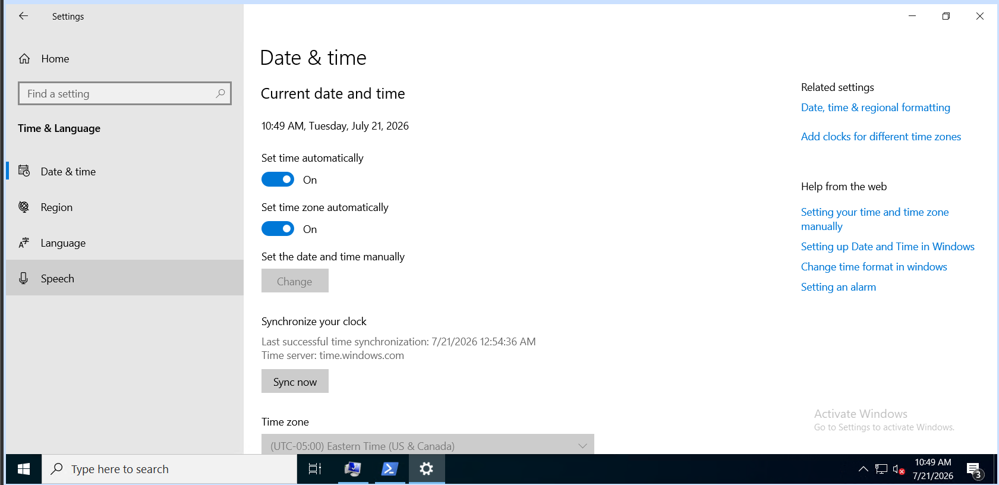

Après le réajustement de l’heure, j’ai retenté la jonction au domaine 

```powershell
PS C:\Windows\system32> Add-Computer -DomainName "udem.lan" -NewName "PC-PROF-01" -Credential (Get-Credential) -Force -Restart
cmdlet Get-Credential at command pipeline position 1
Supply values for the following parameters:
Credential
Add-Computer : Computer 'DESKTOP-I1L0RFM' was successfully joined to the new domain 'udem.lan', but renaming it to
'PC-PROF-01' failed with the following error message: The account already exists.
```
*📄 Fichier complet : [`code/troubleshooting/33-probleme-de-jonction-au-domaine.ps1`](../code/troubleshooting/33-probleme-de-jonction-au-domaine.ps1)*

La jonction a fonctionné mais pas le prestage.

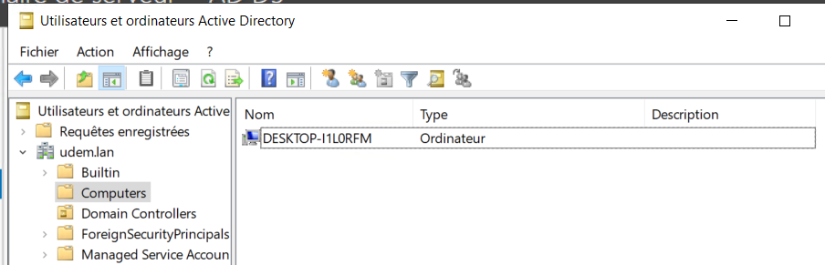

Je le retire du domaine et je vais réessayer en deux différentes étapes :

- Renommer le poste

```powershell
Rename-Computer -NewName "PC-PROF-01" -Restart
```
*📄 Fichier complet : [`code/troubleshooting/34-probleme-de-jonction-au-domaine-2.ps1`](../code/troubleshooting/34-probleme-de-jonction-au-domaine-2.ps1)*

- Joindre le domaine

```powershell
Add-Computer -DomainName "udem.lan" -Credential (Get-Credential) -Restart
```
*📄 Fichier complet : [`code/troubleshooting/35-probleme-de-jonction-au-domaine-3.ps1`](../code/troubleshooting/35-probleme-de-jonction-au-domaine-3.ps1)*

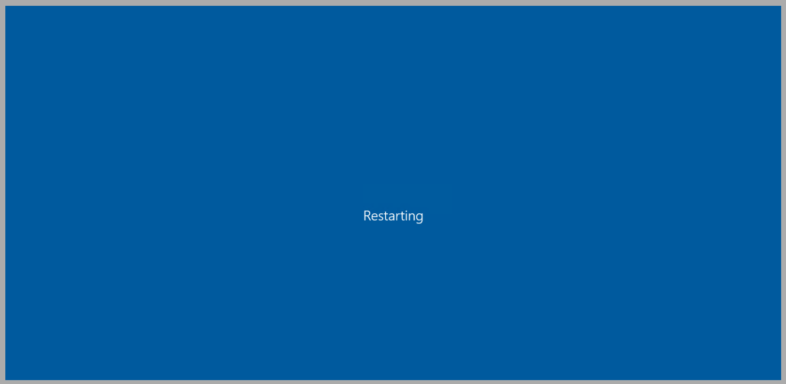

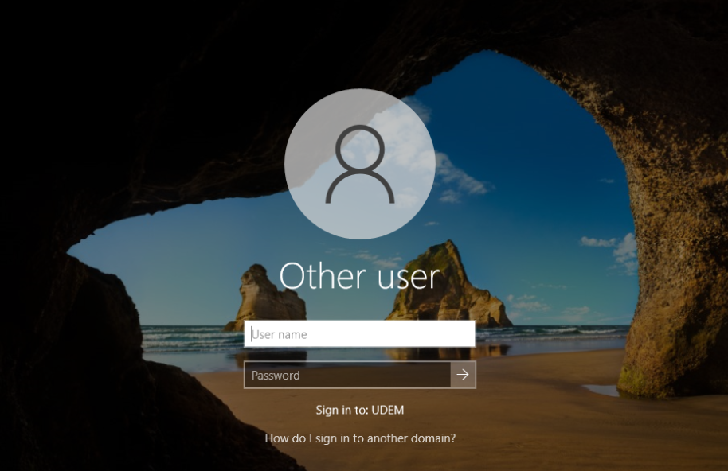

</aside>
